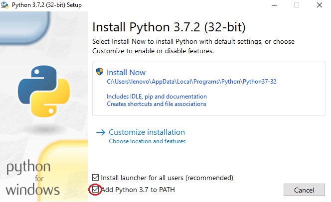
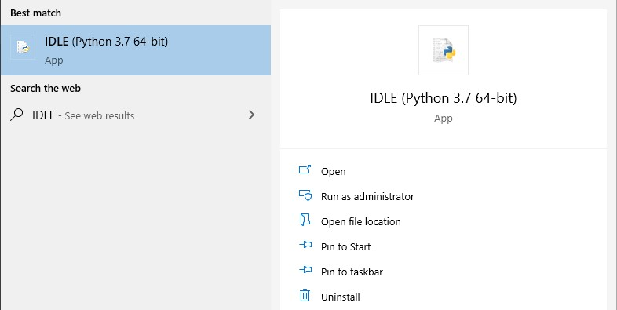
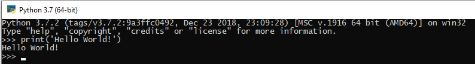

# Section 02: Basic Python Concepts
## Lesson overview
- What is Python ?
- Hello world program in Python
- Mathematical operations in Python
- Strings in Python
- Accepting user input in Python 3
- Variables in Python

### Characteristics of Python
- Python has the advantage:
    - The syntax is short, easy to understand, easy to read and suitable for beginners
    - Support many different platforms and operating systems
    - Very large development community (large library, full documentation)
- Besides Python has some disadvantages:
    - Being a interpreted language, the Python program execution speed is slower than the compiled languages
    - Being a dynamic type language, it is impossible to check all the errors when writing a program
    - Python is not a good language for multi-threading.
### Installing Python And PyCharm
#### Install Python
- Download python here : https://www.python.org/
- Run the setup.exe file with the default options.
Note: At the first windows screen when running the installation program, it is recommended to select the "Add Python 3.x to PATH" option, to facilitate the running of python from the cmd windows after installation
Example : 

#### Install PyCharm
- Python IDE: Pycharm https://www.jetbrains.com/pycharm/download/

- Supporting environment for programming, managing folders / files, libraries, editors, run, debug, testing ...
- Code suggestions, highline, warning syntax errors, code style.
### Hello World Progranm In Python
- Create new program and run the first time
From menu Windows Start , fine IDLE and open App:

- When the IDLE windows has finished booting, type in a command windows to run the test:
    ```
    print('Hello World!')
    ```

### Some other mathematical operations in Python
- Python supports common mathematical calculations. The commonly used calculations are:
    - Addition (+)
    - Subtraction (-)
    - Multiplication (*)
    - Division (/)
    - Integer division (//)
    - Allowance for remainder (%)
    - Power (**)
    - Rounding operation (round)
    - Absolute value operations (abs)
- The calculations +, -, *, / are similar to the arithmetic we already know.
Example:
    ```
    >>> print(1 + 2)
    3
    >>> print(3 - 2)
    1
    >>> print(3 * 4)
    12
    >>> print(1/2)
    0.5
    ```
- Integer division (//) and remainder (%) are performed to divide whole numbers.
    Example:
    ```
    >>> print(5/2)
    2
    >>> print(5%2)
    1
    >>> print(10%2)
    0
    ```
- In Python, exponentiation is represented by two consecutive * signs. (**)
    Example : 2^
    ```
    >>> 2**3
    8
    >>> 3**2
    9
    ```
- Calculation of short form
    - Python allows the use of abridged calculations: + =, - =, * =, / =, // =,% =, ** =
    - The meaning of the abridged calculation is as follows:
        - a + = b is equivalent to a = a + b
        - a - = b is equivalent to a = a - b
        - ...
### Strings In Python
- String data is enclosed in single quotes (') or double quotation marks (")
    ```
    >>>print('Huynh Tan Khoa')
    Huynh Tan Khoa
    print("Hanoi")
    Hanoi
    ```
- Multiline Strings,you can assign a multiline string to a variable by using three quotes:
    Example :
    ```
    a = """Lorem ipsum dolor sit amet,
    consectetur adipiscing elit,
    sed do eiusmod tempor incididunt
    ut labore et dolore magna aliqua."""
    print(a)
    ```
or single quote :
```
a = '''Lorem ipsum dolor sit amet,consectetur adipiscing elit,
sed do eiusmod tempor incididunt
ut labore et dolore magna aliqua.'''
print(a)
```
### Accepting input from the user in Python
- The value of the variables can be declared directly in the program, however, in many cases we want to reuse the program written with other input data sets, in which case we need to allow The user enters data for variables from the keyboard.
In Python, this is done via the input command:
    ```
    >>> input_sthing = input('Text the something :')
    Text the something : Khoa
    'Khoa'
    ```
- The above command will read the characters entered from the keyboard until the Enter character is encountered, the value is stored in the variable declared at the beginning of the command line, this value has a data type of text (String).
- In case we want to get the input value in numerical form, we use the following commands to convert from String data to numeric data:
    - int (text): converts text values of type String to integers
    - float (text): converts text values of type String to decimals
### Performing operations on a string in Python
- Addition of 2 string values:
    - String + String always output string
    ```
    >>> 'Khoa' + 'Huynh'
    KhoaHuynh
    >>> 'Khoa' + ' ' +'Huynh'
    Khoa Huynh
    >>> '5' + '5'
    55
    ```
    - String + Integer is Error 
    ```
    >>> 'khoa' + 5
    Traceback (most recent call last):
    File "<pyshell#0>", line 1, in <module>
        'khoa' + 5
    TypeError: can only concatenate str (not "int") to str
    ```
- Multiplication String and Int
    - string * int
    ```
    >>> 'Khoa' * 3
    KhoaKhoaKhoa
    ```
    - string * string ( Error)
    ```
    >>> 'Khoa' * 'Khoa'
    Traceback (most recent call last):
    File "<pyshell#0>", line 1, in <module>
    'Khoa' *'Khoa'
    TypeError: can't multiply sequence by non-int of type 'str'
    ```
### Variables in Python
- Variables are used to store values ​​during program calculations
- How to declare variables in Python:
    ```
    bienSo = <gia_tri>
    ```
- Where bienSo is the name of the variable to be declared, <gia_tri> is the initial value we want to set for the variable. This value can be a constant or an expression of the declared variable.
For example:
    ```
    >>> x = 1
    >>> y = 2
    >>> z = x + y
    >>> print(z)
    3
    ```
- Once declared, the variable's value can be changed by reassigning a new expression to the variable:
    ```
    >>> x = 1
    >>> x = 2
    >>> x = x + 1
    ```
    - The first line declares the variable x and sets its value to 1
    - The second line changes the value of x to 2
    - The third line increases x by 1 unit
- To delete a variable from memory, you can use the del command:
    ```
    >>> a = 3
    >>> print(a)
    3
    >>> del a
    print(a)
    Traceback (most recent call last):
    File "<pyshell#12>", line 1, in <module>
        print(a)
    NameError: name 'a' is not defined
    ```
- Each variable after being declared will contain a certain value, called data. This data value will depend on one of the data types that Python supports
    - Number data type
    - String data type
    - List data type
    - Tuple data type
    - Set data type
    - Dictionary data type
    - Object data type
- At the beginning stage, we are mainly concerned with 2 data types: numeric and String. The remaining data types will be explored in the following sections.
### In place operators in Python
- The assignment operator is often used to assign the value of the right side to the left side. The table shows the assignment operators:
    Operator|Example|Same As 
    |-------|-------|-----------|
    |=      |x = 5  |x = 5      |
    |+=     |x += 3 |x = x + 3  |
    |-=     |x -= 3 |x = x - 3  |
    |*=     |x *= 3 |x = x * 3  |
    |/=     |x /= 3 |x = x /= 3 |
    |%=     |x %= 3 |x = x %= 3 |
    |//=    |x //= 3|x = x //= 3|
    |**=    |x **= 3|x = x &= 3 |
    |&=     |x &= 3 |x = x &= 3 |
    |^=     |x ^= 3 |x = x ^= 3 |
    |>>=    |x >>= 3|x = x >>= 3|
    |<<=    |x <<= 3|x = x <<= 3|
### Writing our very first program in PyCharm
### Coding Challenge Part 1
### Quiz For Section 2
- A string in Python can be specified in: Both and double single
- Which of the following operators is used to perform exponentiation : **
- Which of the following could be used to perform concatenation of a string: +
- Which of the following allows you to store a value: Variable
- PyCharm is a: Pycharm IDE
### Notes & Summary For Section 2

