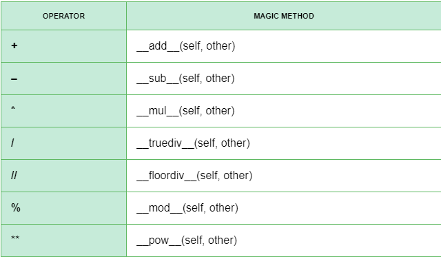
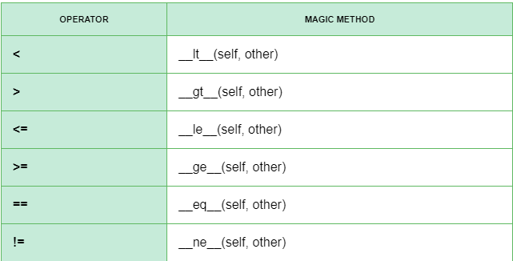

# Section 08: Learn Object Oriented Programming In Python
## Lesson overview
- OOP Terminology
- Recursion In Python
- Recursive Functions in Python
- Sets in Python
- Operator overloading
### Introduction To Object Oriented Programming, Classes & Objects
- Python is a strong object-oriented programming language. Therefore, creating and using objects is extremely easy.
- Python has been an object-oriented language since it existed. Because of this, creating and using classes and objects are downright easy. This chapter helps you become an expert in using Python's object-oriented programming support.
- Object-oriented programming (OOP) is a supporting technique that allows programmers to directly work with objects that they define. The efficiency of this technique increases productivity, simplifies maintenance complexity, and extends the software. Currently there are many object-oriented programming languages ​​such as C ++, Java, PHP, ... and also Python.
- The concept of OOP in Python focuses on creating reusable code. This concept is also known as DRY (Don't Repeat Yourself).
### Class Methods
Class and Object are the two basic concepts in object-oriented programming.
- Objects are entities that exist with behavior.
    - For example, the object is a car with the brand name, color, type of material, behavior of going, stopping, parking, starting the engine ...
- Class is a special user-defined data type, set of many properties specific to all objects created from that class.
    - Attributes are the values ​​of the class. Later when objects are created from the class, the properties of the class will now become the characteristics of that object.
- Distinguishing between an Object and a Class:
    - Object: have state and behavior.
    - Class: Can be defined as a template describing the state and behavior that the object type of the class supports. An object is an instance of a class
### Creating A Class & Defining Class Attributes
-   Class declaration in Python
    ```
    class ClassName:
    
    # declararion object
        def __init__(self, var1, var2, ...):
            self.var1 = var1
            self.var2 = var2
            ....
        
    #  method
        def method1(self, ...)
            # Comand line function
        
        def method2(self, ...)
            # Comand line function
    ```
    Example:
    ```
    class Superman:
        pass

    super_man_A = Superman()

    super_man_A.name = "Super Man Red"
    super_man_A.weapon = "Tonfa"
    super_man_A.color = "Red"

    print("Name of Super man:",super_man_A.name)
    print("Color:",super_man_A.color)
    print("Weapon:",super_man_A.weapon)
    ```
### Instance Attributes & Constructor
- To create instances of a class, you call the class using class name and pass in whatever arguments its ```___init___``` method accepts.
- You need a template that only requires attribute values, and assigns values for the template to do. Of course the template is possible, if we build it a constructor function.
- Explain a few things, this is the conventional function name, if you name the function like that, you default to tell the program that this is the constructor (what it is, you will slowly know). In Python, some functions in the class are automatically called when we declare an object and the constructor is one of those functions.

- The keyword self or specifically here is the parameter self is a convention (note that absolutely will not be syntax error if using different keywords), you can use a different keyword. However, I have never seen anyone use another key other than self. 
- Syntax :
    ```
    class NameObject:
        def __init__(self):
            pass
    ```
- Initialize and use objects

- Syntax for initializing an object of a Class:
    ```
    obj = ClassName (var1, var2, ...)
    ```
- To access the object's method:
    ```
    obj.method1 (...)

    obj.method2 (...)

    ```
- To access the object properties:
    ```
    obj.attr1
    ```
- For example:
    ```
    person = Person ('Huynh Tan Khoa', 'Hanoi')
    person.sayHello ()
    person.updateAddress ('DN ')
    print (f '{person.name} lives at {person.address}')
    ```
### Implementing Methods In Object Oriented Programming
- Methods are functions defined within the body of a class. They are used to determine the behavior of an object.
    ```
    class Car:

        # object properties
        def __init __(self, name_car, color, fuel):
                self.name_car = name_car
                self.color = color
                self.fuel = fuel

            # method
            def stop_car(self, end_point):
                return "{} is stopping for {}". format (self.name_car, end_point)

            def run_car(self):
                return "{} is running on the road" .format (self.name_car)

            def start_turbo (self):
                return "{} is starting" .format (self.name_car)

    # instantiate the Car class
    toyota = Car("Toyota", "Red", "Electricity")
    lamborghini = Car("Lamborghini", "Gold", "Deisel")
    porsche = Car("Porsche", "Green", "Gas")

    # call our instance methods
    print(toyota.stop_car("recharge"))
    print(lamborghini.run_car())
    print(porsche.start_turbo())
    ```
### Function Based vs OOP Way Of Writing Code
- Funtional Program
    ```
    def read(book_name):
        book_name = input('What is book ?')
        book_author = input('What is book ?')
        return print(book_name,book_author)
    read()
    ```
    Output
    ```
    Python OOP
    Khoa
    ```
- OOP Program
    ```
    class Book:
        

        def __init__(self,book_name,book_author):
            self.book_name = book_name
            self.book_author = book_author

        def display(self):
            print(self.book_name)
            print(self.book_author)
    new_book = Book('Pyhton OOP','Khoa')
    new_book.display()
    ```
- Procedure programming or OOP programming are different, if your program is aimed at step - to - step then you should choose Functional Programm, it helps you optimize performance and how to code.

- If you work on projects that have multiple opponents: Game, form, Web. Then you need the OOP program to run that project
### Inheritance
- The inheritance is to reuse something that is already in the new to develop the new.
- To declare a new class inheriting from an existing class:
    ```

    class ChildName(ParentClass):
        ....
    ```
    Example:
    ```
    class Person:


        def __init__(self, name, age):
            self.name, self.age = name, age
        
        def getName(self):
            print("Name: %s" %(self.name))
        
        def getAge(self):
            print("Age: %d" %(self.age))
        def getSex(self):
            print("Sex: %s" %(self.sex))

    class Male(Person):
        sex = "Male";
    ```
- The child class will inherit the properties and methods of the parent class.
    ```
    class Person:
        def __init__(self, name, address):
            self.name = name
            self.address = address
            
        def sayHello(self):
            print(f'Xin chào, tên tôi là {self.name}')    
            
        def updateAddress(self, newAddress):
            self.address = newAddress

    class Student(Person):
        def __init__(self, name, address, company):
            self.name = name
            self.address = address
            self.company = company
            
        def sayHello(self):
            print(f'Xin chào, tên tôi là {self.name}, nhân viên {self.company}')
    
    student = Student('Huỳnh Tấn Khoa', 'Hà Nội', 'Genetica')
    student.sayHello()
    ```
### Multiple Inheritance
- Syntax :
    ```
    class Parent1:
        pass

    class Parent2:
        pass

    class Child(Parent1, Paren2):
        pass
    ```
- Child classes are defined from multiple parent classes and inherit properties of both classes.

- Parent classes may have the same properties or methods. The child class will take precedence over inheriting properties, methods of the first class in the inheritance list.
- Super()
    - In the case of subclasses that you want to use components in the parent class, you must use the super function with the following syntax:
    ```
    # With properties.
    super().variableName
    # With methods.
    super().methodName()
    ```
- Example: I will call ```getName``` method and name attribute of class ```Foo``` while standing in class ```Bar```.
    ```
    class Foo:
        name = 'Foo'
        def getName(self):
            print("Class: Foo")
            
    class Bar(Foo):
        name = 'Bar'
        def getName(self):
            print("Atribute name = " + super().name)
            super().getName()

    Bar().getName()
    # Result:
    # Atribute name = Foo
    # Class: Foo
    ```
### Multi-level Inheritance
- In addition to being able to inherit from parent classes, you can also create new subclasses to inherit previous subclasses. This is called multilevel inheritance.
- In this case, the properties of the parent class and the previous subclass will be inherited from the new subclass.
```
class Parent:
    pass

class Child1(Parent):
    pass

class Child2(Child1):
    pass
```
### Recursion in Python
- Recursion is the way of programming or coding a problem, in which the function calls itself one or more times in the code block. Usually, it returns the return value of the function call. If the function definition satisfies the recursive condition, the function is called the recursive function.
    ```
    # An example of a recursive function to
    # find the factorial of a number
    
    def calc_factorial(x):
        """This is a recursive function
        to find the factorial of an integer"""
    
        if x == 1:
            return 1
        else:
            return (x * calc_factorial(x-1))
    
    num = 4
    print("The factorial of", num, "is", calc_factorial(num))   
    ```
- Advantages:
    - Recursive functions make the code look clean
    - A complex task can be broken down into simpler sub-problems by using recursion.
    - Sequencing is easier with recursion than using some nested iterations.
- Defect:
    - Sometimes the logic behind recursion is hard to follow.
    - Recursive call costs are expensive (inefficient) because they take up a lot of memory and time.
    - Recursive functions are difficult to debug.
### Sets
- The Set data type is used to contain the elements of a collection. Compared with List type, Set type is different:
    - In a Set, there are no 2 elements with the same value.
    - Cannot use index to access the element of a Set
- Function in Set:
    -  add(): add a new value to Set
        For example:
        ```
        s = set([1, 2])
        s.add(3)
        print(s)
        {1, 2, 3}
        ```
    - remove(): remove the element from Set
        For example:
        ```
        s = set([1, 2, 3])
        s.remove(2)
        print(s)
        {1, 3}
        ```
    - in: check if the value is in Set

        For example:
        ```
        s = set([1, 2, 3])
        print(1 in s)
        True
        ```
    - not in: check if the value is not in the set
        For example:
        ```
        s = set([1, 2, 3])
        print(3 not in s)
        False
        ```
    - union(): returns the union of 2 Set
        For example:
        ```
        s1 = set([1, 2, 3])
        s2 = set([3, 4, 5])
        print(s1.union(s2))
        {1, 2, 3, 4, 5}
        ```

    - intersection(): intersection of 2 Set
        For example:
        ```
        s1 = set([1, 2, 3])
        s2 = set([3, 4, 5])
        print(s1.intersection(s2))
        {3}
        ```
    - difference: difference of 2 Set
        For example:
        ```
        s1 = set([1, 2, 3])
        s2 = set([3, 4, 5]) 
        print s1.difference(s2))
        {twelfth}
        ```
### Itertools
- The Python itertools module is a collection of tools for handling iterators. Simply put, iterators are data types that can be used in a for loop. The most common iterator in Python is the list.
- Requirements:
- We must import the ```itertools``` module before we can use it. We will also import the ```operator``` module. This module is not necessary when using itertools, it is only needed for some of the examples below.
```
import itertools
import operator
```
- Some modulesin itertools:
- accumulate(): ```itertools.accumulate(iterable[, func])```
    This function makes an iterator that returns the results of a function. Functions can be passed around very much like variables.
    ```
    data = [1, 2, 3, 4, 5]
    result = itertools.accumulate(data, operator.mul)
    for each in result:
        print(each)
    ```
    Output
    ```
    1
    2
    6
    24
    120
    ```
- combinations() : ```itertools.combinations(iterable, r)```
    This function takes an iterable and a integer. This will create all the unique combination that have r members.
    ```
    shapes = ['circle', 'triangle', 'square',]
    result = itertools.combinations(shapes, 2)
    for each in result:
        print(each)
    ```
    Output
    ```
    ('circle', 'triangle')
    ('circle', 'square')
    ('triangle', 'square')
    ```
### Operator overloading in Python
- Operator Overloading means giving extended meaning beyond their predefined operational meaning. For example operator + is used to add two integers as well as join two strings and merge two lists. It is achievable because ‘+’ operator is overloaded by int class and str class. You might have noticed that the same built-in operator or function shows different behavior for objects of different classes, this is called Operator Overloading.
    Example :
    ```
    # Python Program illustrate how  
    # to overload an binary + operator 
    
    class A: 
        def __init__(self, a): 
            self.a = a 
    
        # adding two objects  
        def __add__(self, o): 
            return self.a + o.a  
    ob1 = A(1) 
    ob2 = A(2) 
    ob3 = A("Geeks") 
    ob4 = A("For") 
    
    print(ob1 + ob2) 
    print(ob3 + ob4) 
    ```
- Cheatsheet Operator overloading:
    - Binary Operators:
    
    - Comparison Operators :
    
### Data hiding in Python
- In Python, we use double underscore (Or __) before the attributes name and those attributes will not be directly visible outside.
    Example:
    ```
    class JustCounter:
        __secretCount = 0
        def count(self):
            self.__secretCount += 1
            print self.__secretCount
    counter = JustCounter()
    counter.count()
    counter.count()
    print counter.__secretCount
    ```
    When the above code is executed, it produces the following result −
    ```
    1
    2
    Traceback (most recent call last):
    File "test.py", line 12, in <module>
        print counter.__secretCount
    AttributeError: JustCounter instance has no attribute '__secretCount'
    ```
- Python protects those members by internally changing the name to include the class name. You can access such attributes as object._className__attrName. If you would replace your last line as following, then it works for you −
    ```
    .........................
    print counter._JustCounter__secretCount
    ```
    When the above code is executed, it produces the following result −
    ```
    1
    2
    2
    ```
### Coding challenge 12
- Using the concept of object oriented programming and inheritance, create a super class named Computer, which has two sub classes named Desktop and Laptop.
- Define two methods in the Computer class named getspecs and displayspecs, to get the specifications and display the specifications of the computer.
- You can use any specifications which you want.
The Desktop class and the Laptop class should have one specification which is exclusive to them for example laptop can have weight as a special specification.
- Make sure that the sub classes have their own methods to get and display their special specification.
- Create an object of laptop/ desktop and make sure to call all the methods from the computer class as well as the methods from the own class
### Coding challenge 12 solution
```
class Computer:
    def __init__(self, ram, memory, processor):
        self.ram = ram
        self.memory = memory
        self.processor = processor

    def getspecs(self):
        print('Please enter the details')
        self.ram = input('Enter Ram Size')
        self.memory = input('Memory size')
        self.processor = input('Enter processor')

    def displayspecs(self):
        print('Here are the specs of the computer')
        print(' Ram size is: ' + self.ram + ' Memory size is: ' + self.memory + ' processor is: ' + self.processor)


class Desktop(Computer):
    def __init__(self, casecolor):
        self.casecolor = casecolor

    def get_case_details(self):
        self.casecolor = input('Enter case color')

    def put_case_details(self):
        print('case color is: ' + self.casecolor)


class Laptop(Computer):
    def __init__(self, weight):
        self.weight = weight

    def getweight(self):
        self.weight = input('Enter weight')

    def displayweight(self):
        print('weight is: ' + self.weight)


comp = Laptop('');

comp.getspecs()

comp.getweight()

comp.displayspecs()

comp.displayweight()
```
### Coding challenge 13
- Using the concept of operator overloading in Python, change the behavior of the multiplication operator in a way that multiplication operator behaves like an addition operator.
### Coding challenge 13 solution
```
class Number:
 
    def __init__(self,x):
        self.x = x
 
    def __mul__(self, other):
        x = self.x + other.x
        return x
 
number_a = Number(3)
 
number_b = Number(4)
 
print(number_a * number_b)
```
### Notes & Summary For Section 8
