# Section 10: Create GUI Apps In Python Using Tkinter
## Lesson overview
- Import the Tkinter module.
- Create the GUI application main window.
- Add one or more of the above-mentioned widgets to the GUI application.
- Enter the main event loop to take action against each event triggered by the user.
### Tkinter : Hello world program
- Tkinter is a package in Python that contains the Tk module that supports GUI programming. Tk was originally written for the Tcl language. Tkinter was later written to use Tk with the Python-based Tcl interpreter. In addition to Tkinter, there are a number of other tools that help create a GUI application written in Python, such as wxPython, PyQt, and PyGTK.
- Example: [Tkinter Program 1]((section-10-create-gui-apps-in-python-using-tkinter/demo-1.py))


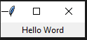
### Tkinter: Using frames
- The Frame widget is very important for the process of grouping and organizing other widgets in a somehow friendly way. It works like a container, which is responsible for arranging the position of other widgets.
- It uses rectangular areas in the screen to organize the layout and to provide padding of these widgets. A frame can also be used as a foundation class to implement complex widgets.
- Syntax:```w = Frame ( master, option, ... )```
- Parameters
    - master − This represents the parent window.
    - options − Here is the list of most commonly used options for this widget. These options can be used as key-value pairs separated by commas.
- Example: [Tkinter Program 2]((section-10-create-gui-apps-in-python-using-tkinter/demo-2.py))


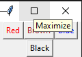
### Tkinter: Grid layout
- This geometry manager organizes widgets in a table-like structure in the parent widget.
- Syntax: ```widget.grid( grid_options )```
- Here is the list of possible options −
    - column − The column to put widget in; default 0 (leftmost column).
    - columnspan − How many columns widgetoccupies; default 1.
    - ipadx, ipady − How many pixels to pad widget, horizontally and vertically, inside widget's borders.
    - padx, pady − How many pixels to pad widget, horizontally and vertically, outside v's borders.
    - row − The row to put widget in; default the first row that is still empty.
    - rowspan − How many rowswidget occupies; default 1.
    - sticky − What to do if the cell is larger than widget. By default, with sticky='', widget is centered in its cell. sticky may be the string concatenation of zero or more of N, E, S, W, NE, NW, SE, and SW, compass directions indicating the sides and corners of the cell to which widget sticks.
- Example: [Tkinter Program 3]((section-10-create-gui-apps-in-python-using-tkinter/demo-3.py))


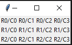
### Tkinter: Self adjusting widget
- The pack() widget is used to organize widget in the block. The positions widgets added to the python application using the pack() method can be controlled by using the various options specified in the method call.
- However, the controls are less and widgets are generally added in the less organized manner.

- Syntax: ```widget.pack(options)``` 
    A list of possible options that can be passed in pack() is given below.
    - expand: If the expand is set to true, the widget expands to fill any space.
    -   Fill: By default, the fill is set to NONE. However, we can set it to X or Y to determine whether the widget contains any extra space.
    - size: it represents the side of the parent to which the widget is to be placed on the window.
- Example: [Tkinter Program 4]((section-10-create-gui-apps-in-python-using-tkinter/demo-4.py))


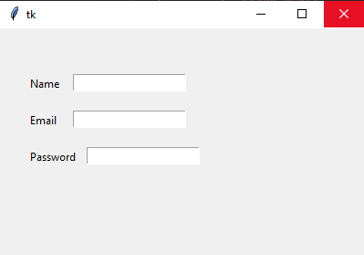
### Tkinter: Handling button clicks
- The button widget is used to add various types of buttons to the python application. Python allows us to configure the look of the button according to our requirements. Various options can be set or reset depending upon the requirements.
- We can also associate a method or function with a button which is called when the button is pressed.
The syntax to use the button widget is given below.
- Syntax: ```W = Button(parent, options)   ```
- Example: [Tkinter Program 5]((section-10-create-gui-apps-in-python-using-tkinter/demo-5.py))


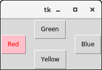


.png)
### Tkinter: Using classes
- Example: [Tkinter Program 6]((section-10-create-gui-apps-in-python-using-tkinter/demo-6.py))


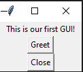 
### Tkinter: Using drop downs
- The Menu widget is used to create various types of menus (top level, pull down, and pop up) in the python application.
- The top-level menus are the one which is displayed just under the title bar of the parent window. We need to create a new instance of the Menu widget and add various commands to it by using the add() method.
- Syntax: ```w = Menu(top, options)```
- Example: [Tkinter Program 7]((section-10-create-gui-apps-in-python-using-tkinter/demo-7.py))


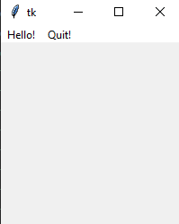 
### Tkinter: Toolbar
- Example: [Tkinter Program 8]((section-10-create-gui-apps-in-python-using-tkinter/demo-8.py))


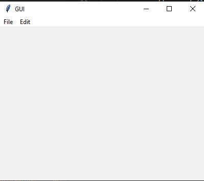 
### Tkinter: Making Status Bar
- A status bar is normally a narrow bar at the bottom of the GUI to indicate some extra information like word counts of the file or anything that could add extra value to the user interface.
- Tkinter doesn’t have a dedicated status bar widget but uses Label widget with appropriate configuration to work as the status bar in the GUI.
- Example: [Tkinter Program 9]((section-10-create-gui-apps-in-python-using-tkinter/demo-9.py))


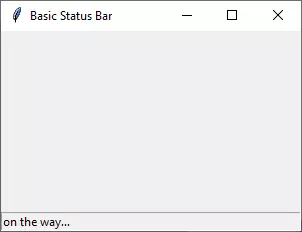 
### Tkinter: Message box
- The Message widget is used to show the message to the user regarding the behaviour of the python application. The message widget shows the text messages to the user which can not be edited.

    - The message text contains more than one line. However, the message can only be shown in the single font.
    - Syntax: ``w = Message(parent, options)``
    - Example: [Tkinter Program 10]((section-10-create-gui-apps-in-python-using-tkinter/demo-10.py))


    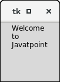
- The messagebox module is used to display the message boxes in the python applications. There are the various functions which are used to display the relevant messages depending upon the application requirements.
    - Syntax: ``messagebox.function_name(title, message [, options])``
    - Example: [Tkinter Program 11]((section-10-create-gui-apps-in-python-using-tkinter/demo-11.py))


    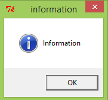
### Tkinter Drawing
- The canvas widget is used to add the structured graphics to the python application. It is used to draw the graph and plots to the python application. 
- Syntax: ``w = canvas(parent, options)  ``
- Example: [Tkinter Program 12]((section-10-create-gui-apps-in-python-using-tkinter/demo-12.py))


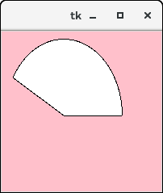