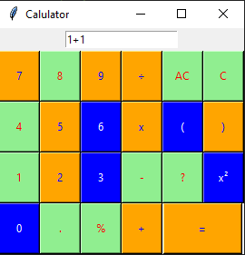
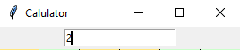
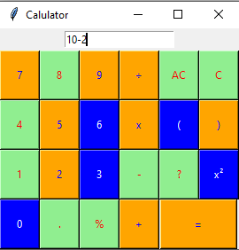
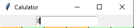
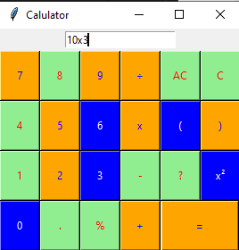
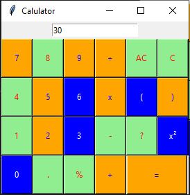
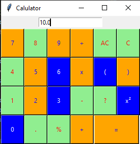

# Section 11: Build calculator app using tkinter
## Lesson overview
- Python offers multiple options for developing GUI (Graphical User Interface). Out of all the GUI methods, tkinter is most commonly used method. It is a standard Python interface to the Tk GUI toolkit shipped with Python. Python with tkinter outputs the fastest and easiest way to create the GUI applications. Creating a GUI using tkinter is an easy task.
- Basic steps:
    - First we create an object named root out of tk.
    - We create an object of the calc and pass root as master to the init method.
    - Mainloop starts an event loop, which is basically an infinite loop waiting for events and respond accordingly. The mainloop can be terminated by closing the window or using close method.
### Building Calculator App Part 1
### Building Calculator App Part 2
### Building Calculator App Part 3
### Building Calculator App Part 4
### My-app
[My-Caculator](section-11-build-calculator-app-using-tkinter/my-app.py)
### Solution
[Solution](section-11-build-calculator-app-using-tkinter/solution.py)
### Test Case
- Case 1 :1 + 1 = 2

- Case 2 : 10 - 2 = 8

- Case 3 : 10 * 3 = 30

- Case 4 : 40 * 4 = 10

