# Section 12: Building Database Apps With PostgreSQL & Python
## Lesson overview
- Learn about Database , PostgreSQL in Python (Section 12)
    - Install PostgreSQL
    - CRUD in SQLshell with PostgreSQL
    - Python code with PostgreSQL
### Introduction To Databases
- A database is a systematic collection of data. They support electronic storage and manipulation of data. Databases make data management easy.
- SQL is the standard language for dealing with Relational Databases. SQL can be used to insert, search, update, and delete database records. SQL can do lots of other operations, including optimizing and maintenance of databases. SQL stands for Structured Query language, pronounced as "S-Q-L" or sometimes as "See-Quel"... Relational databases like MySQL Database, Oracle, MS SQL Server, Sybase, etc. use ANSI SQL.
### Introduction To PostgreSQL
- PostgreSQL is a free and open source relational database management system (RDBMS) focused on scalability and compliance with technical standards. It is designed to handle a wide range of workloads, from personal computers to data warehouses or Web services with multiple simultaneous users.
- Basic information about PostgreSQL
    - Developed by: PostgreSQL Global Development Group
    - First released: July 8, 1996
    - Current version: 11.4 released on June 20, 2019
    - Repository: git.postgresql.org/gitweb/?p=postgresql.git
    - Written in the C programming language
    - Operating System: FreeBSD, Linux, macOS, OpenBSD, Windows
    - Software type: RDBMS
    - License: PostgreSQL License (free and open-source, permissive)
    - Website: postgresql.org
### Installing PostgreSQL On Windows
- Access: https://www.postgresql.org/download/
- Step 1: Choose the operating system


    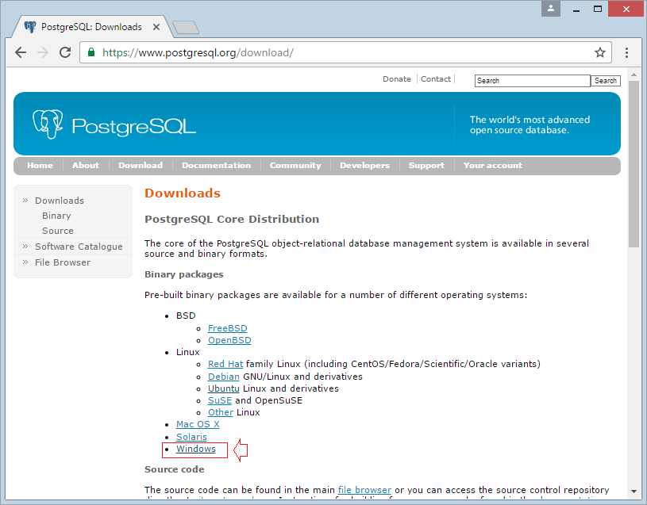
    - Windows: https://www.postgresql.org/download/windows/
    - MacOS: https://www.postgresql.org/download/macosx/
- Step 2: Click download and installer for Windows


    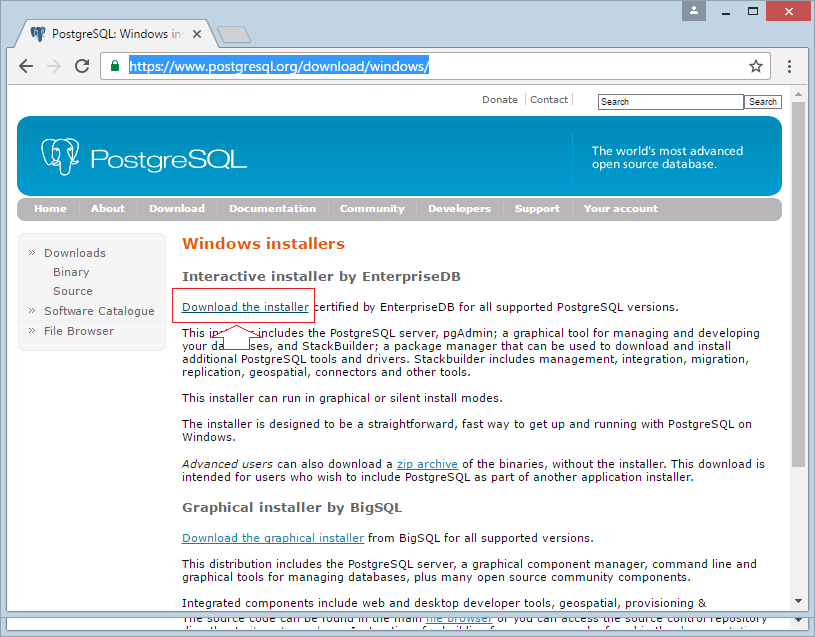
- Step 3: Choose version,you should choose the version that is supported on all operating systems, this helps you have more support communities


    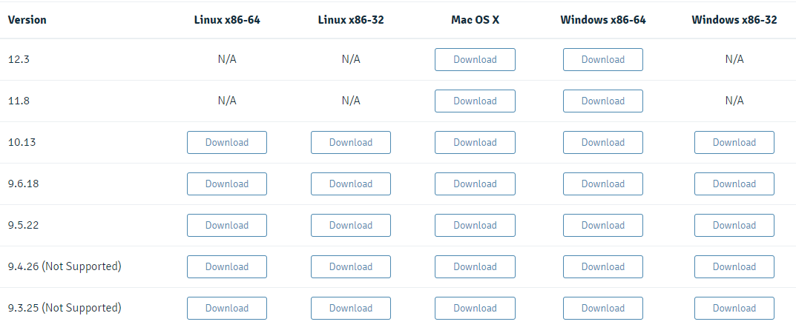
- Step 4: After downloading PostGres in the previous step, you can install it


    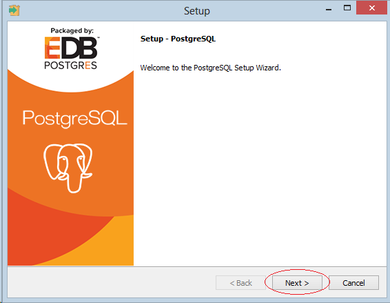
- Step 5: Choose Folder for install


    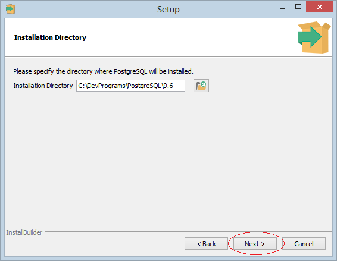
- Step 6: Choose Folder for database store


    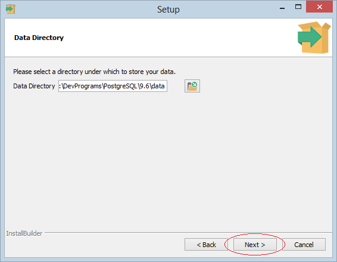
- Step 7: Next you need to enter the password, the default user is "postgres".


    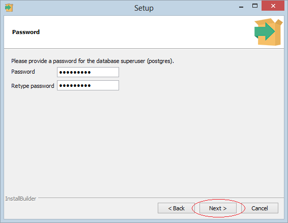
- Step 8: The default port of portgresql is 5432, you can change it if you want.


    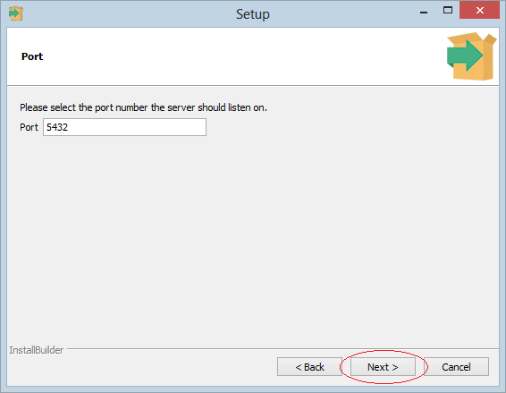
- Step 9: Using the default locale, it will get the information set on your computer.


    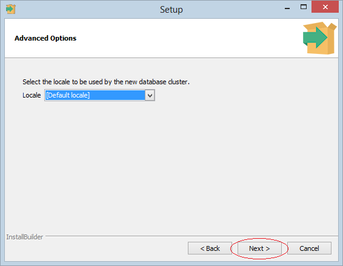
- Step 10: Click Next to finish


    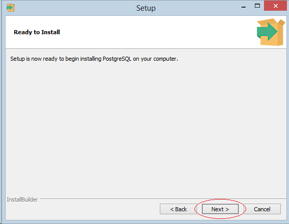
- You can optionally install additional features included in Stack Builder, which is an extension of Postgresql, it includes JDBC libraries, extensions to work with digital map data (GIS), and other tools. You may not need this extension or install it later if you like.
### Installing PostgreSQL On Mac
### Creating A Database
- Step 1: Open SQLshell in Windows.


    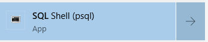
- Step 2: Enter five times to connect DB, and enter the password PostgreSQL


    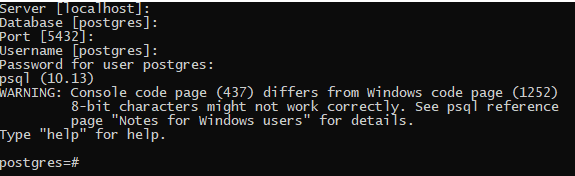
- Step 3: Enter the command: ``CREATE DATABASE <name_database>``


    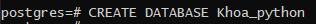
- Step 4: Enter command ``\l`` to get a list of all databases


    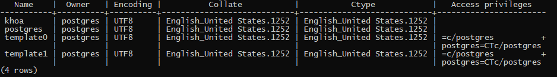
- Step 5: To connect to a Database use the command ``\c guru99``


    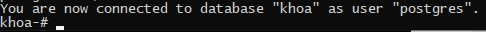
- Prompt changes to ``khoa`` which signifies that we are connected to database ``khoa`` and can perform operations like create table, trigger, execute SQL on it.
### Creating Table & Adding Data
- The PostgreSQL CREATE TABLE statement is used to create a new table in any of the given database.
- Syntax: 
    ```
    CREATE TABLE table_name(
    column1 datatype,
    column2 datatype,
    column3 datatype,
    .....
    columnN datatype,
    PRIMARY KEY( one or more columns )
    );
    ```
    Example:
    ```
    khoa_python=# CREATE TABLE COMPANY(
    khoa_python(#    ID INT PRIMARY KEY     NOT NULL,
    khoa_python(#    NAME           TEXT    NOT NULL,
    khoa_python(#    AGE            INT     NOT NULL,
    khoa_python(#    ADDRESS        CHAR(50),
    khoa_python(#    SALARY         REAL
    khoa_python(# );
    ```
- Insert data in table: ``INSERT INTO TABLE_NAME VALUES (value1,value2,value3,...valueN);``
    Example:
    ```
    INSERT INTO COMPANY (ID,NAME,AGE,ADDRESS,SALARY,JOIN_DATE) VALUES (1, 'Paul', 32, 'California', 20000.00,'2001-07-13');
    ```
### Reading Data From Database
- Command: ``SELECT db_field FROM db_table``
- With condition: ``SELECT db_field FROM db_table WHERE condition``
    - Examle:
    ```
    SELECT * FROM company;
    ```
    - Result:


    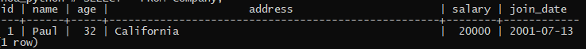
### Setting Up Virtualenv on Mac
### Setting Up Virtualenv On Windows
- Create folder ATN for new project


    
- Open ATN folder in VS code


    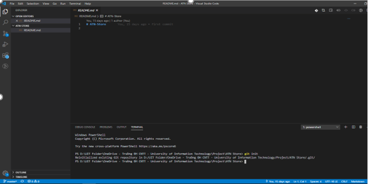
- Open terminal, Create Virtual Envinorment Python in folder
    - Syntax: ``python -m venv venv``


    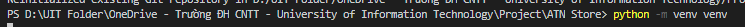
    - Result:


    
- From within VS Code, select a Python 3 interpreter by opening the Command Palette (Ctrl+Shift+P), start typing the Python: Select Interpreter command to search, then select the command. You can also use the Select Python Environment option on the Status Bar if available (it may already show a selected interpreter, too):


    
- Choose python venv in folder


    
- Run Terminal: Create New Integrated Terminal (Ctrl+Shift+`) from the Command Palette, which creates a terminal and automatically activates the virtual environment by running its activation script.


    
- Now you can install any package
    - Example: Install Django


    
    - After downloading successfully, you learn how to develop an app with django.
    - Read the documentation here: https://docs.djangoproject.com/en/2.1/intro/tutorial01/
### Installing Psycopg2
- Psycopg is the most popular PostgreSQL database adapter for the Python programming language
- Open terminal and actitavie venv in folder
- cmd: ``pip install psycopg2``
### Connecting To Database With Python Code
- Use connect() from psycopg2
```
import psycopg2
connection = psycopg2.connect(host="localhost",database="db_name", user="postgres", password="db_password")
```
- The following is the list of the connection parameters:
    - database: the name of the database that you want to connect.
    - user: the username used to authenticate.
    - password: password used to authenticate.
    - host: database server address e.g., localhost or an IP address
    - port: the port number that defaults to 5432 if it is not provided.
- To make it more convenient, we will use a configuration file to store all connection parameters. The following is the content of the ``database.ini`` file:
    ```
    [postgresql]
    host=localhost
    database=khoa_python
    user=postgres
    password=1234
    ```
- The following config() function read the database.ini file and returns the connection parameters. We put the config() function in the config.py file:
    ```
    from configparser import ConfigParser

    def config(filename='database.ini', section='postgresql'):
        # create a parser
        parser = ConfigParser()
        # read config file
        parser.read(filename)

        # get section, default to postgresql
        db = {}
        if parser.has_section(section):
            params = parser.items(section)
            for param in params:
                db[param[0]] = param[1]
        else:
            raise Exception('Section {0} not found in the {1} file'.format(section, filename))

        return db
    ```
- The following connect() function connects to the ``khoa_python`` database and prints out the PostgreSQL database version.
    Source code: [config.py](section-12-building-database-apps-with-postgreSQL-and-python/config.py)
    Source code: [python-postgresql.py](section-12-building-database-apps-with-postgreSQL-and-python/python-postgresql.py)
    Result:


    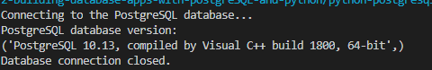
### Creating Database Tables With Python
- To create a new table in a PostgreSQL database, you use the following steps:
    - First, construct a CREATE TABLE statement.
    - Next, connect to the PostgreSQL database by calling the connect() function. The connect() function returns a connection object.
    - Then, create a cursor object by calling the cursor() method of the connection object.
    - After that, execute the CREATE TABLE by calling the execute() method of the cursor object.
    - Finally, close the communication with the PostgreSQL database server by calling the close() methods of the cursor and connection objects.
- The following create_tables() function creates four tables in the ``khoa-python`` database: vendors, parts, vendor_parts, and part_drawings.
    Source code: [Create Table](create-table.py)
    Result:


    
### Adding Data To Database Tables With Python
- First, connect to the PostgreSQL database server by calling the connect() function of the psycopg module.
    ``conn = psycopg2.connect(dsn)``
    The connect() function returns a new instance of the connection class.
- Next, create a new cursor object by calling the cursor() method of the connection object.
    ``cur = conn.cursor()``
- Then, execute the INSERT statement with the input values by calling the execute() method of the cursor object.
    ``cur.execute(sql, (value1,value2))``
- You pass the INSERT statement to the first parameter and a list of values to the second parameter of the execute() method.
- In case the primary key of the table is an auto-generated column, you can get the generated ID back after inserting the row. To do this, in the INSERT statement, you use the RETURNING id clause. After calling the execute() method, you call the  fetchone() method of the cursor object to get the id value as follows:
    ``id = cur.fetchone()[0]``
- After that, call the commit() method of the connection object to save the changes to the database permanently. If you forget to call the commit() method, psycopg will not change anything to the database.
    ``conn.commit()``
- Finally, close the communication with the PostgreSQL database server by calling the close() method of the cursor and connection objects.
    ```
    cur.close()
    conn.close()
    ```
- Example:
    - [Source code](insert.py)


    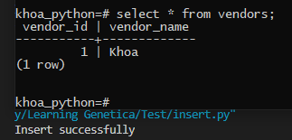
### Creating App Layout
- Distribute the label
- Identify labels, attributes and entries
- [Source Code](app.py)
- Result:


    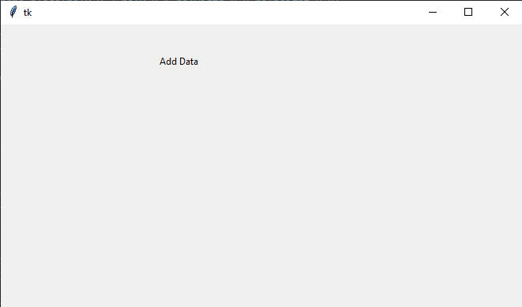
### Adding Entries
- Syntax: ``name_entry = Entry(frame)``
- Locate: ``name_entry.grid(row=x,column=y)``
- Example:
    ```
    entry_name = Entry(frame)
    entry_name.grid(row=1,column=1)

    entry_age = Entry(frame)
    entry_age.grid(row=2,column=1)

    entry_phone = Entry(frame)
    entry_phone.grid(row=3,column=1)
    ```
-Result:


    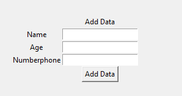
### Saving Entries To Database
- Use knowledge about insert data by python code 
```
def get_data(name,age,phone):
    conn =psycopg2.connect(
        host='localhost',
        database='management',
        user='postgres',
        password='1234'
    )

    cur = conn.cursor()
    query= '''INSERT INTO student (NAME,AGE,PHONE) VALUES (%s,%s,%s);'''
    cur.execute(query,(name,age,phone))
    print('Insert Successfully')
    conn.commit()
    conn.close()

button = Button(
    frame,text="Add Data",
    command= lambda:  get_data(
        entry_name.get(),
        entry_age.get(),
        entry_phone.get()
    )
)
```
- Result:


    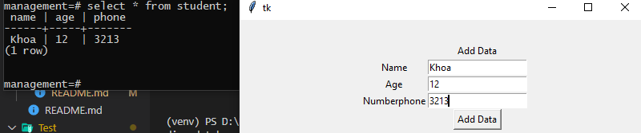
### Search Functionality
- Example:
    ```
    def search(name):
        conn =psycopg2.connect(
            host='localhost',
            database='management',
            user='postgres',
            password='1234'
        )
        cur = conn.cursor()
        query= f'''SELECT * FROM student WHERE NAME = '{name}' ;'''
        cur.execute(query,(name))
        row = cur.fetchone()
        print(row)
        conn.commit()
        conn.close()

    label = Label(frame,text="Search Data")
    label.grid(row = 5,column=1)

    label = Label(frame,text="Search by Name")
    label.grid(row = 6,column=0)

    entry_data = Entry(frame)
    entry_data.grid(row=6,column=1)

    button = Button(
        frame,text="Search Data", command= lambda:search(entry_data.get())
    )
    button.grid(row=6,column=2)
    ```
- Result:


    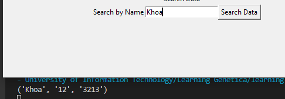
### Listing All Entries
- Example: 
    ```
    def display_all():
        conn =psycopg2.connect(
            host='localhost',
            database='management',
            user='postgres',
            password='1234'
        )
        cur = conn.cursor()
        query= '''SELECT * FROM student  ;'''
        cur.execute(query)
        row = cur.fetchall()

        listbox = Listbox(frame,width=20,height=5)
        listbox.grid(row=10,column=1)
        for x in row:
            listbox.insert(END,x)
    ```
- Result:


    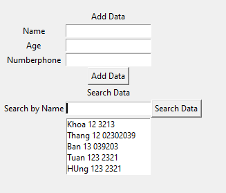