# Section 13: Data Analysis Using Python
## Lesson overview
- Data Requirement Gathering
- Data Collection
- Data Cleaning
- Data Analysis
- Data Interpretation
- Data Visualization
### Introduction to Data Analysis Using Python
#### What is Data Analysis
- Data analysis is the process of evaluating data using statistical or analytical tools to discover useful information. Some of these tools are programming languages ​​like R or Python. Microsoft Excel is also popular in the world of data analysis.
- When data is collected and organized using these tools, the results will be interpreted to make decisions. The final results can be distributed in summary form or in visual form as graphs or graphs.
- The process of presenting data in a visual form is called data visualization. Data visualization tools make the job easier.
- There are several methods of data analysis including data mining, text analytics, and business intelligence.
#### How to analysis data ?
- Define goals: Start by outlining some clearly defined goals. In order to get the best results from the data, the goals have to be clear.
    - Ask questions: Find out the questions you want to answer with data.
    - For example, do red sports cars crash more often than other vehicles? Figure out which data analysis tools will get the best results for your question.
- Data collection: Collecting useful data to answer questions. 
    - In this example, data may be collected from a variety of sources such as DMV or police accident reports, insurance claims, and admission details.
- Data Scrubbing: Raw data can be collected in a number of different formats, with lots of invalid and messy things. The data needs to be "cleaned" and converted so data analysis tools can import it. This step is very important.
- Data analysis: Enter this new "clean" data into data analysis tools. These tools allow you to explore data, find patterns and answer what-if questions (what happens, if ...). This is where you find results!
- Draw conclusions and make predictions: Draw conclusions from your data. These conclusions can be summarized in a report, visual chart or both to get correct results.
### Installing tool for data analysis
- Link Download : https://www.anaconda.com/products/individual
- Click next in process download
- Open Anaconda Navigator
- Open Jupyter book and lauch


    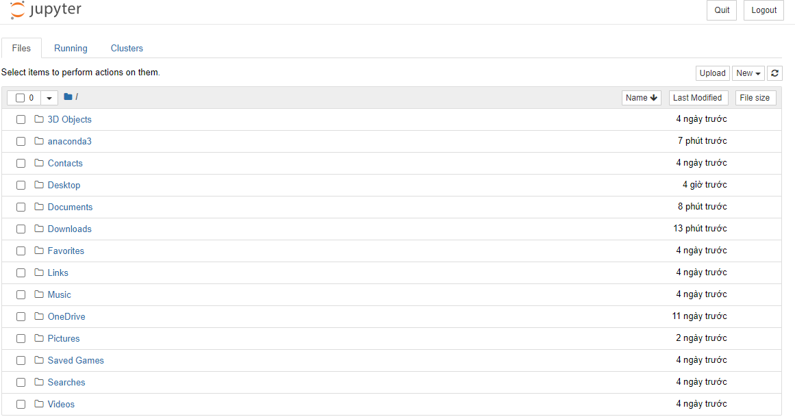
- Create new file: ``day-6.ipynb``


    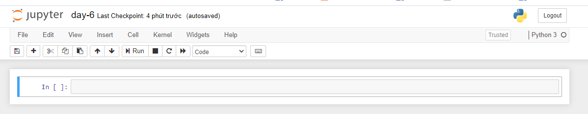
-  Write notes and code example for notes day-6:


    
### Introduction to Pandas and series
- Pandas is a library that allows processing of structured data tables. A data table consists of multiple columns, each corresponding to a field of the data object. This description is similar to storing data in excel, csv and database files
- In pandas, the concept of a data table is equivalent to a DataFrame object
- Using Pandas Series
    - Syntax: ``from pandas import series``
    - Example:


    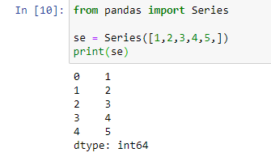
- The series in pandas like list in python,but the series you can change index for data, type of list have default is 0,1,2,3,...
    - Example:


    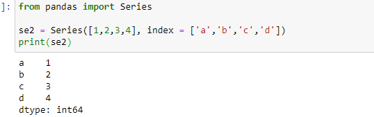
- With ``Series``, index creation can be accessed by creating index without having to specify index = default
    - Example:


    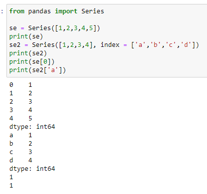
### Converting Dictionaries to Series
- Series can change ``dict ``data type to ``Series`` and access by index without having to follow ``key-values``
    - Example: 


    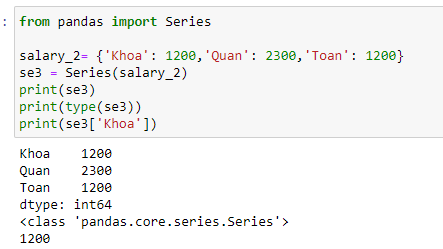
### Introduction Data Frames
- To create a new data table (DataFrame), it is necessary to pass the data column names with the values of the columns
    - Example: 
    ```
    >>> from pandas import DataFrame
    >>> table = DataFrame({
        'id' : [1, 2, 3],
        'price' : [50000, 100000, 80000],
        'quantity' : [10, 15, 12]
        })
    >>> print(table)
    ```
    - Output
    ```
    id   price  quantity
    0   1   50000        10
    1   2  100000        15
    2   3   80000        12
    ```
    - Result:

    
    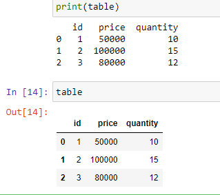
### Changing Column Sequence
- Syntax: ``new_frame = DataFrame(data,columns=['new_col1,'new_col2','new_col3','new_coln',...])``
- Example:


   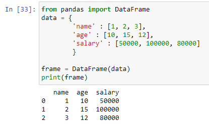


   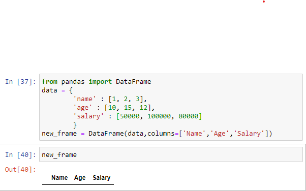

- Add columns in dataframe
    - Example:

    
    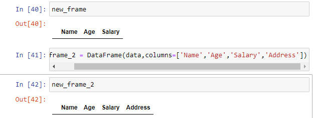
- Query  column Dataframe:
    - Syntax: ``frame[<column>]``
    - Example:


    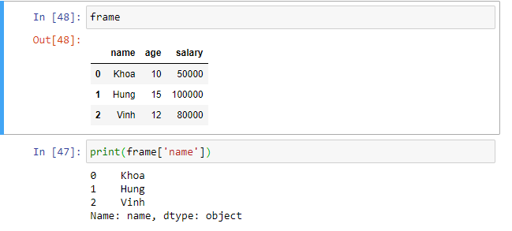
- Query row in Dataframe:
    - Syntax: ``frame.loc[row]``
    - Example:


    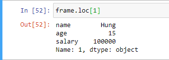   
### Changing columns and Transposing DataFrame
- Insert multi data in  column:
    - Syntax = ``frame[<column>] = 'Data'``
    - Example:
        - Before entering data


            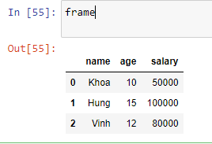       
        - Then, we add to column ``address``

            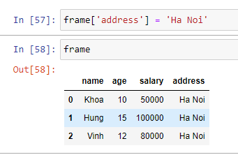
- Transposing DataFrame:
    - Syntax: ``frame = frame.T``
    - Example:
        - Transposing 1:


            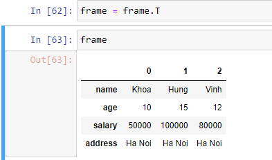   
        - Trasposing 2:


            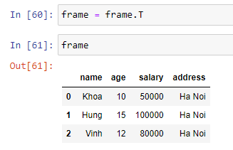
### Reindexing Series & DataFrames
- Reindexing changes the row labels and column labels of a DataFrame. To reindex means to conform the data to match a given set of labels along a particular axis.
- Multiple operations can be accomplished through indexing like
    - Reorder the existing data to match a new set of labels.
    - Insert missing value (NA) markers in label locations where no data for the label existed.
- Reindexing Index:
    - Synax: ``new_frame = frame.reindex([<index1>,<index2>,<index3>,<indexn>,...])``
    - Example:


    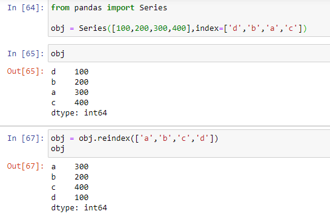
    - After generating random indexes, this lost the ability to sort so I reindexed it by indexes in order.
- Reindexing column
    - Syntax: ``new_frame = frame.reindex([<col1>,<col2>,<col3>,<col3>,...])``
    - Example:


    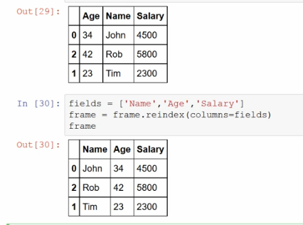
    - Change column for display dataframe
### Deleting Rows & Coulumns
- Delete data with index
    - Syntax: ``new_frame = frame.drop([<index>])``
    - Example:


    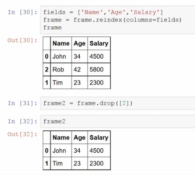
- Delete data with column
    - Syntax: ``new_frame = frame.drop('<column'>,axis = 1 or 0)``
    - Example:


    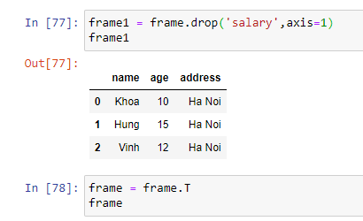


    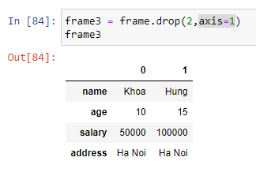
### Arithmetic operations on dataframe and series
- Series + Series in Pandas:
    - Example:
    ```
    from pandas import Series

    series1 = Series([1,2,3,4,5,])
    series2 = Series([100,200,300,400,500])
    sum = series1 + series2
    print(sum)
    ```
    - Output
    ```
    0    101
    1    202
    2    303
    3    404
    4    505
    ```
- DataFrame + DataFrame in Pandas:
    - Example:
    ```
    from pandas import DataFrame
    data1 = {
            'name' : ['Khoa', 'Toan', 'vinh'],
            'age' : [10, 15, 12],
            'salary' : [50000, 100000, 80000]
            }
    data2 = {
            'name' : ['AnhDuong', 'AnhTuan', 'AnhDong'],
            'age' : [20, 35, 15],
            'salary' : [500, 2000, 3000],
            'address': ['Hà Nội','Đà Nẵng','Hồ Chí Minh']
            }
    frame1 = DataFrame(data1)
    frame2 = DataFrame(data2)
    frame1 + frame2
    ```
    - Output:


    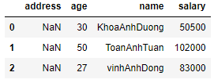
- The operator in pandas will access each element and add them to the corresponding element.
- If there is no element between DataFrame or Series, the return result is ``NaN``
### Arithmetic operations in between dataframe and series
- DataFrame +(-) Series: When adding and subtracting DataFrame and Series, first take the value of Series index and values, then use that value to add each value corresponding to the column Dataframe = index Series
    - Series:


    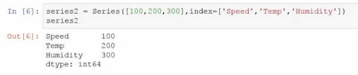
    - DataFrame:


    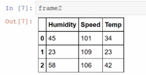
    - Output: 


    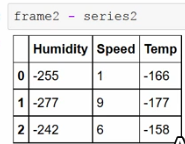
### Sorting series and dataframes
- Using the ``sort_index()`` method, by passing the axis arguments and the order of sorting, DataFrame can be sorted. By default, sorting is done on row labels in ascending order.
- Sorting series
    - Example:
        - Before sort:


        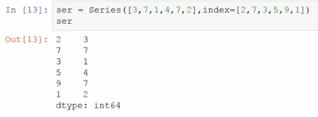        
        - After sort: 


        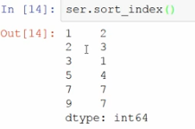 
- Sorting dataframes
    - Example:
        - Before sort:


        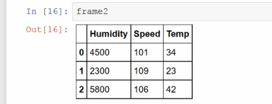        
        - After sort: 


        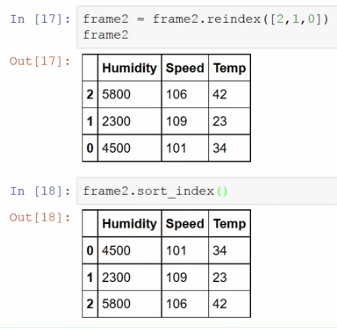
    - ``axis`` is an attribute, to determine the sort by any element (0 is index, 1 is column)
        - ``axis = 0`` is default for ``sort_index()``
        

        
        - ``axis = 1`` is sorted by column


        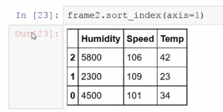
    - ``ascending`` to determine sort in order (True is ascending, False is descending)


        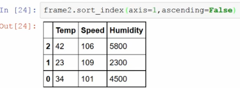
### Sorting according to values
- Like index sorting, ``sort_values()`` is the method for sorting by values. It accepts a 'by' argument which will use the column name of the DataFrame with which the values are to be sorted.
- Sorting series
    - Example:
        - Before sort:


        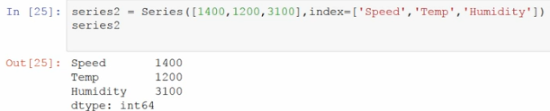        
        - After sort: 


        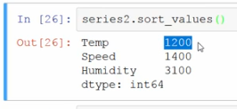
- Sorting dataframe
    - Syntax: ``frame2.sort_values(by='<values>')``
    - Example:
        - Before sort:


        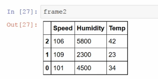        
        - After sort: 


        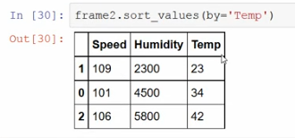
### Handling duplicate values
- Syntax: ``series.index.is_unique()``
- The above function is used to check if there are index duplicates in the Series type of Pandas


    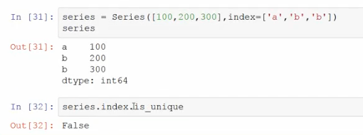
### Calculating sum, max & min values
- ``sum()``: Returns the sum of the values
    - Syntax:  ``frame.sum()``
    - ``axis = 0`` sum values by index
    - Example:
        
        
        

    - ``axis = 1`` sum values by column
    - Example:


        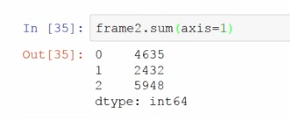
- ``idmax()``: Returns the index with the highest value in Series or Dataframe
    - Syntax: ``frame.idmax()`` 
    - Example:


        
- ``idmin()``: Returns the index with the lowest value in Series or Dataframe
    - Syntax: ``frame.idmin()`` 
    - Example:


        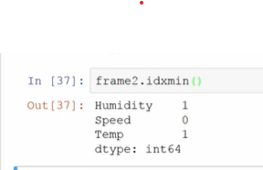
### Dropping nan values
- ``frame.dropna()``: The following command will remove the data in the form of NaN, basically the usual commands will not be deleted like drop (), remove ()
    -   Example:


        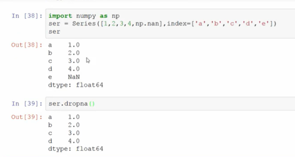
- ``frame.fillna()``: The following command will add the data to the place where NaN data is available, possibly with ch options.
    - Example: 
        - Before fill data:


            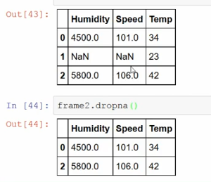
        - After fill data:


            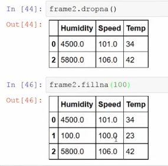
### Loading data from a file
- To read data from the csv file, use the function:
    ```
    pandas.read_csv(filepath, sep=', ')
    ```
- Inside:
    - ``filepath``: path to the csv file
    - ``sep``: the character separating the values in the csv file
- Example:
    
    
    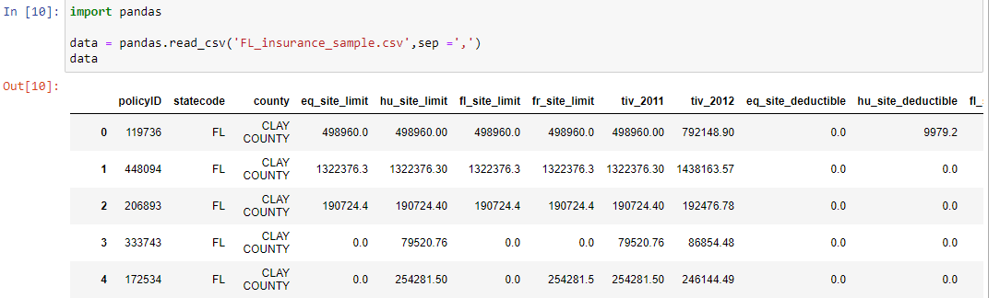
### Analyzing file data
- View Data with column
    - Syntax:
    ```
    from pandas import DataFrame
    data_frame = DataFrame(data_frame,columns=['<col1>','<col2>','<col3>','<col4>','<col5>',...'])
    data_frame
    ```
    - Example:


    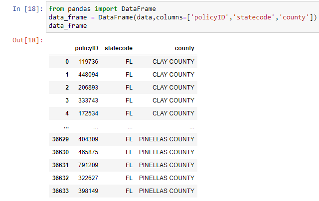
- Drop data with index
    - Syntax: ``data_frame = data_frame.drop([1])``


    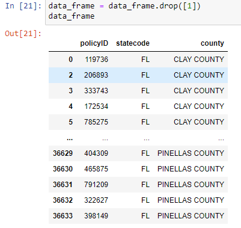
- Drop data with column
    - Syntax: ``data_frame = data_frame.drop('col_name',axis = 1)``
    - Example:


    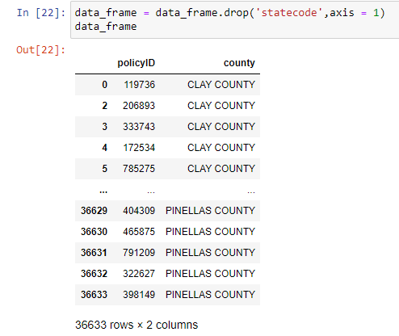
- Sort data with column:
    - Syntax: ``data_frame = data_frame.sort_values(by='<col_name>')``
    - Example: 

    
    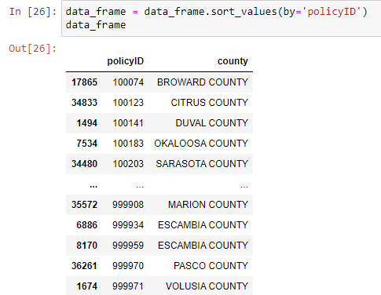
- Sum data with column:
    - Syntax: ``data_frame = data_frame.sum()``
    - Example: 

    
    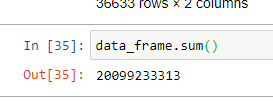
### Creating Numpy Array
- Numpy is a library that allows the processing of numeric arrays (one-dimensional & multi-dimensional). Compared to Python's built-in List type, numpy arrays are different in that they are array elements of the same data type (int, float, string, etc.), so the processing speed on these arrays is faster than with handling on List type.
- Syntax: 
    - Array: ``a = np.array([val1,val2,val3,...])``
    - Array from old array: ``a.reshap(2,2)``
    ```
    import numpy as np
    a = np.array([1,2,3,4])
    a.reshap(2,2)
    ```
    Output


    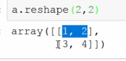

### 19 Another way to create an array
- Creating a One-dimensional Array
    - Syntax: 
    ```
    import Numpy as np
    array = np.arange(20)
    array
    ```
    Output
    ```
    array([0,  1,  2,  3,  4,
       5,  6,  7,  8,  9,
       10, 11, 12, 13, 14,
       15, 16, 17, 18, 19])
    ```
- Creating a Two-dimensional Array
    - Syntax: 
    ```
    array = np.arange(20).reshape(4,5)
    array
    ```
    Output
    ```
    array([[ 0,  1,  2,  3,  4],
       [ 5,  6,  7,  8,  9],
       [10, 11, 12, 13, 14],
       [15, 16, 17, 18, 19]])
    ```
- Using Other Numpy Functions: ``zeros()`` and ``ones()`` to quickly create and populate an array.
    - Syntax:

    ```
    np.zeros((2,4))

    np.ones((3,4))
    ```
    Output
    ```
    array([[0., 0., 0., 0.],
       [0., 0., 0., 0.]])

    array([[1., 1., 1., 1.],
       [1., 1., 1., 1.],
       [1., 1., 1., 1.]])
    ```
- The ``empty()``  creates an array. Its initial content is random and depends on the state of the memory.
    - Syntax:
    ```
    np.empty((2,3))
    ```
    Output
    ```
    array([[0.65670626, 0.52097334, 0.99831087],
       [0.07280136, 0.4416958 , 0.06185705]])
    ```
- The ``full()`` creates a n * n array filled with the given value.
    - Syntax:
    ```
    np.full((2,2), 3)
    ```
    Output
    ```
    array([[3, 3],
       [3, 3]])
    ```
- The ``eye()`` lets you create a n * n matrix with the diagonal 1s and the others 0.
    - Syntax:
    ```
    np.eye(3,3)
    ```
    Output
    ```
    array([[1., 0., 0.],
       [0., 1., 0.],
       [0., 0., 1.]])
    ```

### Logspace & Linspace
- The ``linspace() `` returns evenly spaced numbers over a specified interval. For example, the below function returns four equally spaced numbers between the interval 0 and 10.
    - Syntax:
    ```
    np.linspace(0, 10, num=4)
    ```
    Output
    ```
    array([ 0., 3.33333333, 6.66666667, 10.])
    ```
- The ``logspace() `` returns number spaces evenly w.r.t interval on a log scale.
    - Syntax:
    ```
    np.logspace(1.0,2.0,num = 10)
    ```
    Output
    ```
    arr([ 10., 12.91549665, 16.68100537, 21.5443469, 27.82559402,
    35.93813664, 46.41588834, 59.94842503, 77.42636827,100.,])
    ```
### Slicing a Numpy Array
- Slicing in python means taking elements from one given index to another given index.
    - Syntax:
    ```
    import numpy as np 
    a = np.arange(10) 
    s = slice(2,7,2) 
    ```
    Output
    ```
    [2  4  6]
    ```
- With indexing
    - Syntax:
    ```
    import numpy as np 
    a = np.arange(10) 
    b = a[2:7:2] 
    print b
    ```
    Output
    ```
    [2  4  6]
    ```
### Advanced indexing and slicing techniques
- Logic: The first array for each value in the array is the index of the old array. Retrieve the given index. Following the given array will be the index in each of the pre-selected index arrays
    - Example:
    ```
    a = [[1,2,3],[4,5,6],[7,8,9]]
    b = a[[0,1,2],[0,1,0]]
    ```
    Output
    ```
    [1,5,7]
    ```
- Using condition:
    - Syntax:


    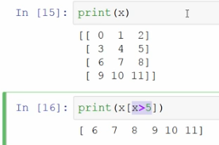
### Broadcasting
- If the two arrays are the same size, the +, -, *, /, **,%, //, ... calculations can be performed on those two arrays. The result is an array of the same size where each element is the result of the operation performed on each element pair of the two input arrays.
    ```
    >>> X1 = numpy.array([[1,2],[3,4]])
    >>> print(X1)
    [[1 2]
    [3 4]]

    >>> X2 = numpy.array([[5,6],[7,8]])
    >>> print(X2)
    [[5 6]
    [7 8]]

    >>> X3 = X1 + X2
    >>> print(X3)
    [[ 6  8]
    [10 12]]

    >>> X4 = X1 ** 2
    >>> print(X4)
    [[ 1  4]
    [ 9 16]]
    ```
### Iterating using nditer
- The function ``nditer()`` is a helping function that can be used from very basic to very advanced iterations. It solves some basic issues which we face in iteration
    - Syntax:
    ```
    import numpy as np

    arr = np.array([[[1, 2], [3, 4]], [[5, 6], [7, 8]]])

    for x in np.nditer(arr):
    print(x)
    ```
    Output
    ```
    1
    2
    3
    4
    5
    6
    7
    8
    ```
### Plotting data using Matplotlib
- Matplotlib is a library for drawing graphs.
- The line graph shows the relationship between two quantities.
    - Syntax:
    ```
    import matplotlib.pyplot as plt

    X= list(range(-5, 6)))
    Y= [x*x for x in X]

    plt.plot(X,Y)

    plt.show()
    ```
- Choose color and line shape
    - To select drawing colors and lines, use the fmt parameter of the plot function.
    - This parameter has a 2-part string: The first color is the color:
         
        - ``b``: blue
        - ``g``: green
        - ``r``: red
        - ``c``: cyan
        - ``m``: magenta
        - ``y``: yellow
        - ``k``: black
        - ``w``: white
    - The rest of ``fmt`` is in line form:
        - ``-``: solid line
        - ``--``: dashed line
        - ``-.``: dashed dots line
        - ``:``: dotted line
        - ``.``: Only draw at points in the input list
- Example:
    ```
    import matplotlib.pyplot as plt

    X= list(range(-5, 6))
    Y= [x*x for x in X]

    plt.plot(X,Y, 'r--')

    plt.show()
    ```


    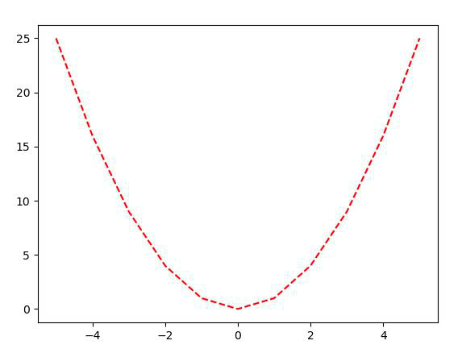
### Analysing Supermarket Sales Data Part 1: Reading CSV File
- Source csv: [sales.csv](section-13-data-analysis-using-python/sales.csv)
- Open and read csv
    ```
    import pandas as pd

    data = pd.read_csv('sales.csv')
    data
    ```


    
### Analysing Supermarket Sales Data Part 2: Switching Up The Theme
- Open cmd or bash: Text ``pip install jupyterthemes``
- Open jupyter notebook: 
    ```
    from jupyterthemes import get_themes
    import jupyterthmes as jt
    from jupyterthemes.stylefx import set_nb_theme
    set_nb_theme('monokai')
    ```


    
### Analysing Supermarket Sales Data Part 3: Accessing Different Parts Of Data
- View head 10 row in dataset
    ```
    data.head(10)
    ```
    Output
        
    
    
- View data flow column
    ```
    data.['Invoice ID']
    ```
    Output


    
- View unique data:
    ```
    data['Category'].unique()
    ```
    Output
    

    
- View data flow index:
    ```
    data.iloc[1]
    ```
    Output


    
- View data by indexing:
    ```
    data[1:10]
    ```
    Output


    
### Analysing Supermarket Sales Data Part 4: Selecting Rows On A Condition
- View with condition
    ```
    data[data['Gender'] == 'Male']
    ```
    Output


    
    ```
    data[data['Total'] > 10]
    ```
    Output


    
- With `unique()`,`head()`
    ```
    data[data['Gender'] == 'Male'].head()
    ```
    Output


    
### Analysing Supermarket Sales Data Part 5: Queries To Find Conditional Data
- Query with `query()`
    ```
    data.query('City == "NewYork"')
    ```
    Output


    
### Analysing Supermarket Sales Data Part 6: Sum, Max, Min & Average
- Sum data
    ```
    data.sum()
    ```
    Output


    
    - Sum data with column
        ```
        data.sum()['Total']
        ```
        Output
        ```
        207788
        ```
- Find max ,min data with `max()`,`min()`
    ```
    data.max()
    ```
    Output


     
    - Sum data with column
    ```
    data.max()['Total']
    ```
    Output
    ```
    693
    ```
- Find Average with mean()
    ```
    data.mean()['Total']
    ```
    Output
    ```
    207.788
    ```
### Analysing Supermarket Sales Data Part 7: Using GroupBy To Group Data By Location
- Groupby column
    ```
    data.groupby('City')
    ```
    Output
    ```
    <pandas.core.groupby.generic.DataFrameGroupBy object at 0x0000024B3CCAF288>
    ```
    - Query,view data in group
    ```
    data.groupby('City').sum()
    ```
    Output


        
### Analysing Supermarket Sales Data Part 8: Finding Market Share
- Create dataset:
    ```
    location = [x for x,y in location_list]
    location
    ```
    Output
    ```
    ['Brookfield', 'Park lane', 'Water tower']
    ```
    Next
    ```
    data.groupby('Location').sum()['Total']
    ```
    Output


    
- Draw graph:
    ```
    import matplotlib.pyplot as plt

    plt.bar(location,data.groupby('Location').sum()['Total'])
    ```
    Output


    
    - Cycle
    ```
    import matplotlib.pyplot as plt

    plt.pie(data.groupby('Location').sum()['Total'])
    plt.show()
    ```
    Output


    

### Analysing Supermarket Sales Data Part 9: Classifying Shoppers
- Step 1 : Group by Location and Gender
    ```
    location_sales = data.groupby(['Location','Gender']).count()['Invoice ID']
    location_sales
    ```
    Output
    ```
    Location     Gender
    Brookfield   Female    179
                Male      161
    Park lane    Female    179
                Male      153
    Water tower  Female    143
                Male      185
    ```
- Unstack to view row and column
    ```
    unstacked_sales = location_sales.unstack(level = 0)
    unstacked_sales
    ```


    
- Draw graph
    ```
    unstacked_sales.plot(kind = 'bar')
    ```


    
### Analysing Supermarket Sales Data Part 10: Analysing Memberships & Ratings
- Group by Location and Member
    ```
    members = data.groupby(['Member','Location']).count()['Invoice ID']
    members
    ```
    Output
    ```
    Member  Location   
    No      Brookfield     173
            Park lane      167
            Water tower    159
    Yes     Brookfield     167
            Park lane      165
            Water tower    169
    ```
- Unstack to view row and column
    ```
    members_untacked = members.unstack(level = 0)
    members_untacked
    ```


    
- Draw graph
    ```
    members_untacked.plot(kind = 'bar')
    ```


    
### Analysing Supermarket Sales Data Part 11: Answering Multiple Queries
- Who spend more money ?
    ```
    spend = data.groupby('Gender').sum()['Total'] 
    spend.plot(kind='bar')
    plt.show()
    ```


    
### Analysing Supermarket Sales Data Part 12: Classifying Sales By Day
- Group by Day
    ```
    day_sales = data.groupby('Day').sum()['Total']
    day_sales.plot(kind='bar')
    plt.show()
    ```


    
### Analysing Supermarket Sales Data Part 13: Classifying Sales By Month
- Group by Month
    ```
    Month_sales = data.groupby('Month').sum()['Total']
    Month_sales.plot(kind='bar')
    plt.show()
    ```

    
    
### Analysing Supermarket Sales Data Part 14: Classifying Sales By Hour
- Group by Hour
    ```
    hour_sales = data.groupby('Hour').sum()['Total']
    hour_sales.plot(kind='bar')
    plt.show()
    ```

    
    
### Analysing Supermarket Sales Data Part 15: Classifying Payment Types With Hour
- Group by Hour and Payment
    ```
    hour_sales = data.groupby('[Hour','Payment]).count()['InvoiceID'].unstack(level=0).plot(kind='bar')
    plt.show()
    ```

    
    
                    