# Section 14: Make Web Applications In Python Using Django 
## Lesson overview
- Install Django==1.11.2
- Create Project
- Create app
- MVC/MVT model web app
- Database in Django
- Create view list data
- Adding data
- Use admin panel
- Create new urls and view
- Connect database
- Use template
- Design detail view
- Use static file
- Use form in Django
### Installing Django For MAC Users
- Step 1: Verify that you have Python on your computer
    - Open your terminal and type: ``python --version``
- Step 2: Install pip

    - After you have made sure that you have Python, it is time to install pip.

        - `pip` is a tool that enable us to easily install Django.

    - If you are not sure if you have pip on you computer, you can open your terminal and enter:
        ```
        pip --version
        ```
    - If you don’t have `pip` on your computer, you have to get the `get-pip.py` installation file. 

    - Afterwards, change directory to the location get-pip.py, go to your terminal, and enter:
        ```
        python get-pip.py
        ```

- Step 3: Using pip to install Django

    - After you make sure you have pip installed on your computer, go to the terminal and enter:
        ```
        sudo pip install Django
        ```
    - You will need to enter the password of your computer.
- Step 4: Create a project

    - Open your terminal, cd to your Desktop or the place where you want to put your project and enter the following command:
        ```
        django-admin.py startproject mysite
        ```
- Step 5:
    - In your terminal, cd to into the blog folder and enter:
        ```
        python manage.py runserver
        ```
### Django Tutorial 1: Installing Django on Windows
- Create folder ATN for new project


    
- Open ATN folder in VS code


    
- Open terminal, Create Virtual Envinorment Python in folder
    - Syntax: ``python -m venv venv``


    
    - Result:


    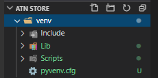
- From within VS Code, select a Python 3 interpreter by opening the Command Palette (Ctrl+Shift+P), start typing the Python: Select Interpreter command to search, then select the command. You can also use the Select Python Environment option on the Status Bar if available (it may already show a selected interpreter, too):


    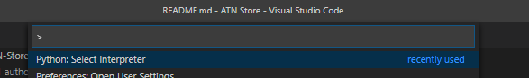
- Choose python venv in folder


    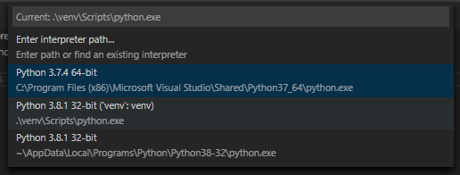
- Run Terminal: Create New Integrated Terminal (Ctrl+Shift+`) from the Command Palette, which creates a terminal and automatically activates the virtual environment by running its activation script.


    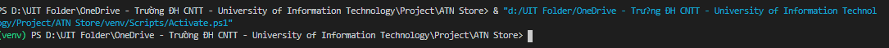
- Now you can install any package
    - ``python -m install django==1.11.2``
    - Example: Install Django


    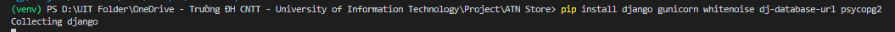
    - After downloading successfully, you learn how to develop an app with django.
    - Read the documentation here: https://docs.djangoproject.com/en/2.1/intro/tutorial01/
### Django tutorial 2: Creating Our First Django Project
- Create new project with Django From the cmd windows
    ```
    django-admin startproject <name_project>
    ```
    Example:
    ```
    django-admin startproject mysite
    ```
- The new project will be created in the mysite directory with the following files:
    ```
    mysite/
        manage.py
        mysite/
            __init__.py
            settings.py
            urls.py
            wsgi.py
    ```
- From the cmd window, move into the project (mysite) folder and start the server with the command:
    ```
    cd mysite
    python manage.py runserver
    ```
    Result:


    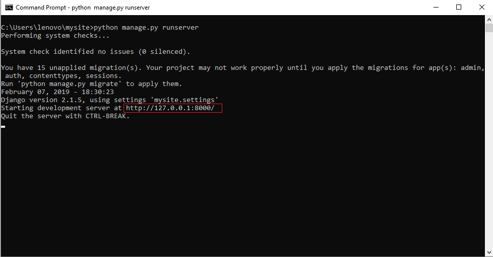
- By default, the server will be running at http://127.0.0.1:8000
    Result:


    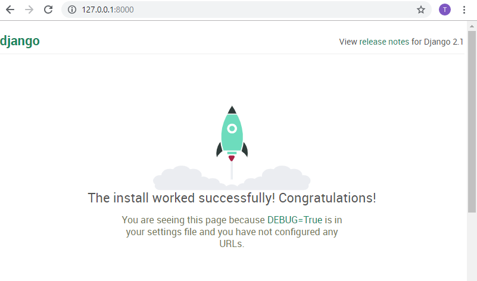
- To change the ip address and the port on which the server will run, you can issue:
    ```
    python manage.py runserver 80
    ```
    - It changes port server to port 8080
    - A few examples of port servers:
    ```
    python manage.py runserver 8080             # listen at port 8080
    python manage.py runserver 0.0.0.0:8080     # listen at port 8080, all ip
    python manage.py runserver 0: 8080          # listen at port 8080, all ip
    ```
### Django tutorial 3: Creating Our Own App
- Each django project is usually divided into several small applications (apps). To create a new application in a django project, use the command:
    ```
    python manage.py startapp <app>
    ```
    Or
    ```
    django-admin startapp <app>
    ```
- Where ``<app>`` is the name of the application you want to create. After being created, the application directory structure is as follows:
    ```
    books/
        admin.py
        apps.py
        migrations/
            __init__.py
        models.py
        tests.py
        views.py
        __init__.py
    ```
    Example:


    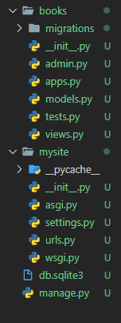
- Components in the application:
    - ``admin.py``: Perform the application object registration (usually Database model) on the django admin page
    - ``apps.py``: The application configuration information
    - ``migrations``: The directory containing the database scripts is automatically generated
    - ``models.py``: Contains Database model declarations
    - ``test.py``: Contains the Unit test
    - ``views.py``: Contains mapping requests for the view tier
### Django tutorial 4: Overview Of an App in Django
- The components in Django's MVC model are as follows:


    
-  Description: 
    - Model: as declared in the `models.py` file of the application. The objects declared here will correspond to the entities in the database.
    - View: Contains display content of pages. This content is expressed as a django template and saved as an `html file`. Basically, these are html pages to represent the content of objects brought down by the controller floor. Using the `template` language allows access to server-side variables to get variable values.
    - Controller: Contains controller functions corresponding to requests mapped to specified url addresses. Each control function performs data access / update functions and then transmits these data objects to the view layer for display.
### Django tutorial 5: Creating Our Own Views in Django
- Step 1: Create View from user in ``views.py``
    ```
    from django.http import HttpResponse


    def index(request):
        return HttpResponse("Hello, world. You're at the books index.")
    ```
- Step 2: Create ``urls.py`` in folder books
    ```
    books/
        __init__.py
        admin.py
        apps.py
        migrations/
            __init__.py
        models.py
        tests.py
        urls.py
        views.py
    ```
- Step 3: In the books/urls.py file include the following code:
    ```
    from django.conf.urls import url

    from . import views

    urlpatterns = [
        url(r'^$', views.index, name='index'),
    ]
    ```
- Step 4: Point the root URLconf at the books.urls module. In mysite/urls.py, add an import for django.conf.urls.include and insert an include() in the urlpatterns list, so you have:
    ```
    from django.conf.urls import include, url
    from django.contrib import admin

    urlpatterns = [
        url(r'^books/', include('books.urls')),
        url(r'^admin/', admin.site.urls),
    ]
    ```
- Step 5: You have now wired an index view into the URLconf. Lets verify it’s working, run the following command:
```
python manage.py runserver
```
- Go to ``http://localhost:8000/books/`` in your browser, and you should see the text “Hello, world. You’re at the books index.”, which you defined in the index view.
### Django tutorial 6: Applying Migrations
- Explain: The database engine and connection information used in the current project are stored in the DATABASES section of the settings.py file. By default, the database engine used is sqlite, the entire database of the project is contained in the file db.sqlite3 located in In the project root directory:
    ```
    DATABASES = {
        'default': {
            'ENGINE': 'django.db.backends.sqlite3',
            'NAME': os.path.join(BASE_DIR, 'db.sqlite3'),
        }
    }
    ```
- To switch to using other database engines, first you need to install drivers for the database engine. For example, install the driver for PostgreSQL:
    ```
    python -m pip install pycopg2
    ```
- Then add the database connection information in the `settings.py` file:
    ```
    DATABASES = {
        'default': {
            'ENGINE': 'django.db.backends.postgresql',
            'NAME': 'management',
            'USER':'postgres',
            'PASSWORD':'1234',
            'HOST':'localhost',
            'PORT':'5432'
        }
    }
    ```
    - ``ENGINE``: Database connection structure Each database will have a way to set up ti
    - ``NAME``: The name database
    - ``USER``: The username, the default is ``postgres``
    - ``PASSWORD``: The password for PostgreSQL
    - ``HOST``: The local host, you use for create database, default is `localhost` or `http://127.0.0.1:5432/`
    - ``PORT``: 5432, port connect to localhost
### Django tutorial 7: Creating Books Table in Django
- Django uses ORM to interact with Database. Database models are declared in the `models.py` file of the application and need the `django.db.models.Model` class.
    ```
    class Book(models.Model):
        
        name = models.CharField(max_length=100)
        author = models.CharField(max_length=100)
        price = models.CharField(max_length=100)
        type = models.CharField(max_length=100)
    ```
### Django tutorial 8: Final Steps in Creating Table
- Step 1: Sign in `books` app to `settings.py`
    ```
    INSTALLED_APPS = [
        'django.contrib.admin',
        'django.contrib.auth',
        'django.contrib.contenttypes',
        'django.contrib.sessions',
        'django.contrib.messages',
        'django.contrib.staticfiles',
        'books'
    ]
    ```
    Or
    ```
    ...
    'books.apps.BookConfig'
    ```
- Step 2: After declaring the object, to update the new changes to the database, the command should be executed:
    ```
    python manage.py makemigrations app

    python manage.py migrate
    ```
### Django tutorial 9: Adding Data to the Database Tables
- Step 1: Text command: ``python manage.py sqlshell``
- Step 2: Text command: ``from books.models import Book``
- Step 3: Text command: ``Book.objects.all()``


    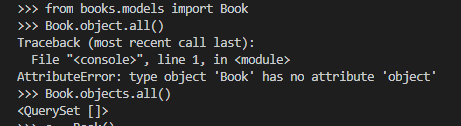
- Step 4: Adding data in your database
    ```
    >>> a = Book()
    >>> a.name ="Python Master"
    >>> a.author = "Khoa"
    >>> a.price ="$14"
    >>> a.type ="Education"
    >>> a.year ="2000"
    >>> a.save()
    ```
- Step 5: View database
    ```
    >>> a.name
    'Python Master'
    >>> a.author
    'Khoa'
    >>>
    ```
### Django tutorial 10: Filtering the Results
- Filltering with id
    ```
    >>> Book.objects.filter(id = 3)  
    <QuerySet [<Book: Python 2-Quan>]>
    >>> 
    ```
### Django tutorial 11: Admin Pannel in Django
- Open cmd: Text command: ``python manage.py createsuperuser``
    ```
    Username (leave blank to use 'khoa'): khoa
    Email address: khoa@gmail.com
    Password:
    Password (again):
    This password is too short. It must contain at least 8 characters.
    This password is entirely numeric.
    Password:
    Password (again):
    Superuser created successfully.
    ```
    - Notes: Create password with 8 characters
- Sign in Models in Admin panel
    - Open `admin.py` in folder `books`
    ```
    from .models import Book
    # Register your models here.

    admin.site.register(Book)
    ```
    

    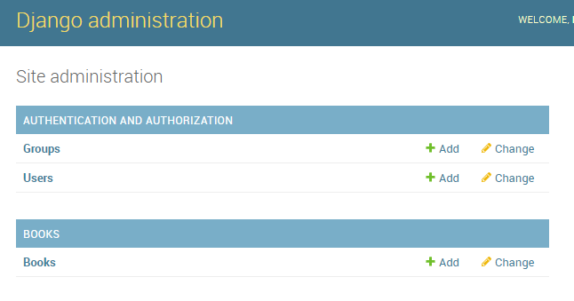


    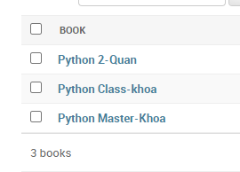
### Django tutorial 12: Creating Another View in Django
- Step 1: Create function view in `views.py`
    ```
    def detail(request,book_id):
        response = "You're looking at the results of book %s."
        return HttpResponse(response % book_id)
    ```
- Step 2: Create url Pattern in `urls.py`
    ```
    urlpatterns = [
        url(r'^$', views.index, name='index'),
        url(r'^(?P<book_id>[0-9]+)/$', views.detail, name='detail'),
    ]
    ```
- Test in localhost


    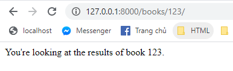
### Django tutorial 13: Connecting to the Database
- Create connect database in views.py
    ```
    def index(request):
        all_book = Book.objects.all()
        html = ''
        for book in all_book:
            url = '/books/' +str(book.id)+'/'
            html += '<a href = "'+ url + '">' + str(book.name) + '</a><br>'
        return HttpResponse(html)
    ```
- Show data in web:


    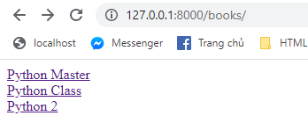
### Django tutorial 14: Creating Templates
- In ``views.py`` use template loader in Django:
```
from django.http import HttpResponse
from .models import Book
from django.template import loader

def index(request):
    all_books =  Book.objects.all()
    template = loader.get_template('books/index.html')
    context = {
        'all_books': all_books
    }
    return HttpResponse(template.render(context,request))
```
- Create folder ``templates``, create file ``index.html``:
    ```
    <html lang="en">
    <head>
        <meta charset="UTF-8">
        <meta name="viewport" content="width=device-width, initial-scale=1.0">
        <title>Document</title>
    </head>
    <body>
        
            <h1>The Book ID is {{book.id}}</h1>
        
    </body>
    ```
- Result:


    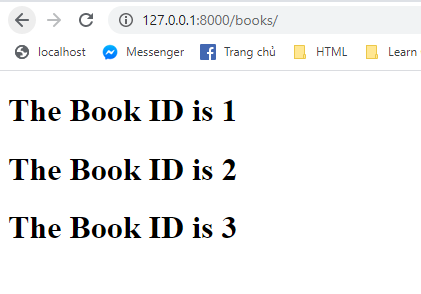
### Django tutorial 15: Rendering Templates
- Edit file `views.py`
    - Add ``from django.shortcuts import render``
    - Delete ``template = loader.get_template('books/index.html')``
    - Change `return render(request,'books/index.html',context)`
```
from django.shortcuts import render

def index(request):
    all_books = Book.objects.all()
    context = {
        'alls_books': all_books
    }
    return render(request,'books/index.html',context)
```
### Django tutorial 16: Raising a 404 Error
- Edit `detail()` in `views.py`
    - Add Http404
    - Create detail.html in templates/books
```
from django.http import Http404


def detail(request,book_id):
    try:
        book = Book.objects.get(id = book_id)
    except Book.DoesNotExist:
        raise Http404('No Book is here')
    return render(request,'books/detail.html',{'book': book})
```
- Result


    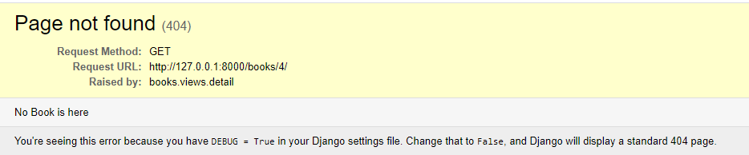
### Django tutorial 17: Designing The Detail View
- Code HTML in ``detail.html``
    ```
    <h1>{{book.id}}</h1>

    <h1>{{book.name}}</h1>

    <h1>{{book.author}}</h1>

    <h1>{{book.price}}</h1>

    <h1>{{book.type}}</h1>

    <h1>{{book.author}}</h1>
    ```
- Result


    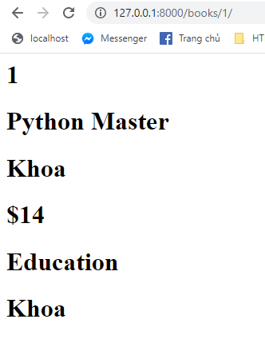
### Django tutorial 18: Removing The Hardcoded Urls
- In `index.html` change tag `<a>`
    ```
     
    ```
### Django tutorial 19: Namespaces in Django
- Extend project capabilities, if no namespace is set, then for ``, only one url exists.
    - But if you want to expand the product also need detail, you won't create it
    - That's why we need namespaces
- Example:
    In `detail.html`
    ```
    <a href ="">{{book.name}}</a>
    ```
    In `urls.py`
    ```
    app_name = 'books'

    urlpatterns = [
        url(r'^$', views.index, name='index'),
        url(r'^(?P<book_id>[0-9]+)/$', views.detail, name='detail'),
    ]
    ```
### Django tutorial 20: Using Static Files In Django
- Create folder `static/books/style.css`
   
   
   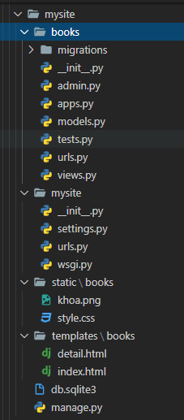
- Next we need to fix the index.html file
    ```
    
    <link rel="stylesheet" type="text/css" href="" /> 
    ```
- The line  will automatically assign the path to the mysite / polls / static / directory to a variable named static that Django has set itself, from which you only need to get the static variable to get the absolute path. to this directory.
- Then we just need to remove the static variable in the `` tag pair and append the path to your css, js ... files
### Django tutorial 21: Creating Our Navigation Bar
- Using bootstap framework
    ```
    <nav class="navbar navbar-inverse">
            <div class="container-fluid">
                <a class="navbar-brand" href="">The Bookstore</a>
            </div>
        </nav>
    ```
### Django tutorial 22: Navigation Bar Touchup
- Add code in tag `nav`
    ```
    <nav class="navbar navbar-inverse">
            <div class="container-fluid">
                <a class="navbar-brand" href="">The Bookstore</a>
                <div class="collapse navbar-collapse">
                    <ul class="nav navbar-nav">
                        <li class="">
                            <a href="">
                                <span class="glyphicon glyphicon-book" aria-hidden="true"></span>&nbsp; Books
                            </a>
                        </li>
                    </ul>
                    <ul class="nav navbar-nav navbar-right">
                        <li class="">
                            <a href="">
                                <span class="glyphicon glyphicon-plus-sign" aria-hidden="true"></span>&nbsp; Add Book
                            </a>
                        </li>
                        <li class="">
                            <a href="">
                                <span class="glyphicon glyphicon-log-out" aria-hidden="true"></span>&nbsp; Logout
                            </a>
                        </li>
                    </ul>
                </div>
            </div>
        </nav>
    ```
### Django tutorial 23: Using Base Templates
- Create `base.html`
    ```
    
    <!DOCTYPE html>
    <html lang="en">
    <head>
        <meta charset="UTF-8">
        <title>Title</title>
        <link rel="stylesheet" type="text/css" href="" >
            <link rel="stylesheet" href="https://maxcdn.bootstrapcdn.com/bootstrap/3.3.7/css/bootstrap.min.css"
                integrity="sha384-BVYiiSIFeK1dGmJRAkycuHAHRg32OmUcww7on3RYdg4Va+PmSTsz/K68vbdEjh4u" crossorigin="anonymous">
    </head>
    <body>
        <nav class="navbar navbar-inverse">
                <div class="container-fluid">
                    <a class="navbar-brand" href="">The Bookstore</a>
                    <div class="collapse navbar-collapse">
                    <ul class="nav navbar-nav">
                        <li class="">
                            <a href="">
                                <span class="glyphicon glyphicon-book" aria-hidden="true"></span>&nbsp; Books
                            </a>
                        </li>
                    </ul>
                    <ul class="nav navbar-nav navbar-right">
                        <li class="">
                            <a href="">
                                <span class="glyphicon glyphicon-plus-sign" aria-hidden="true"></span>&nbsp; Add Book
                            </a>
                        </li>
                        <li class="">
                            <a href="">
                                <span class="glyphicon glyphicon-log-out" aria-hidden="true"></span>&nbsp; Logout
                            </a>
                        </li>
                    </ul>
                </div>
                </div>
        </nav>
            
            
    </body>
    </html>
    ```
- Edit `index.html`
    ```
     
    <link rel="stylesheet" type="text/css" href="books/style.css">
    <div class=" col-md-12 jumbotron">
        <h1>The Bookstore</h1>
        <p>Collection of all popular books</p>
    </div>
    <div class=" col-md-10 jumbotron jumbotron-special" name="fig">
        <div class="col-md-12 span-2">
            <h2>Popular Books</h2>
        </div>
    </div>
    <ul>
        
        <!--<li><a href="">{{book.name}}</a></li>
        -->
        <!--new code starts here-->
        <div class="col-lg-3 col-md-4 col-sm-6 ">
            <div class="thumbnail">
                
                <div class="caption">
                    <h3>{{book.name}}</h3>
                    <p>{{book.author}}</p>
                    <p>
                        <a href="" class="btn btn-primary" role="button">
                    Details
                </a>
                        <a href="#" class="btn btn-danger" role="button">
                    Delete
                </a>
                    </p>
                </div>
            </div>
        </div>
        <!--new code ends here-->
        
    </ul>
    
    ```
### Django tutorial 24: Generic Views In Django
-  People have gathered the common parts of the knowledge and model in the view (controller) to develop and abstract them so that we can write processing data in views without writing too much code.
We will find out that there are quite a few general tasks together such as displaying lists in objects, displaying details, ...
-  Edit file `views.py`
    ```
    from django.views import generic

    from .models import Book
    class IndexListView(generic.ListView):
        template_name = "books/index.html"

        def get_queryset(self):
            return Book.objects.all()

    class DetailView(generic.DetailView):
        model = Book
        template_name = "books/detail.html"
    ```
- Edit `urls.py`
    ```
    from django.conf.urls import url
    from . import views

    app_name = 'books'

    urlpatterns = [
        url(r'^$', views.IndexListView.as_view(), name='index'),
        url(r'^(?P<pk>[0-9]+)/$', views.DetailView.as_view( ), name='detail'),
    ]
    ```
### Django tutorial 25: Design Touchup
- Add css in `style.css`
    ```
    body {
        background: white;
    }

    .jumbotron {
        background: white url("yellow.jpg");
    }

    .jumbotron-special {
        background: white url("purple.png");
    }

    .jumbotron-special h2 {
        color: white;
    }
    ```
- Add code in `detail.html`
    ```
     
    <div class="col-lg-3 col-md-4 col-sm-6">
    <div class="thumbnail">
        

        <div class="caption">
        <h3>{{book.name}}</h3>
        <p>{{book.author}}</p>
        <p></p>
        </div>
    </div>
    </div>

    <div class="col-lg-9 col-md-4 col-sm-6">
    <div class="">
        <h3><b>{{book.name}}</b></h3>
        <p><b>Author:</b> {{book.author}}</p>
        <p><b>Price:</b> {{book.price}}$</p>
        <p><b>Category:</b> {{book.type}}</p>

        <a href="#" class="btn btn-danger" role="button">
        Read Sample <span class="glyphicon glyphicon-book"></span>
        </a>
    </div>
    </div>

    

    ```
### Django tutorial 26: Form To Add Books
- `CreateView() `in views
```
class BookCreateView(CreateView):
    model = Book
    fields = [
        'name','author','price',
        'type','year','book_image'
    ]
    template_name = "books/book_form.html"

```
- Edit `books/urls.py`
    ```
    urlpatterns = [
        url(r'^$', views.IndexListView.as_view(), name='index'),
        url(r'^(?P<pk>[0-9]+)/$', views.DetailView.as_view( ), name='detail'),
        url(r"^books/add/$", views.BookCreateView.as_view(), name="book-add"),
    ]
    ```
- Add `reverse()` in class Book model
    ```
    def get_absolute_url(self):
            return reverse("book:details", kwargs={"pk": self.pk})
    ```
### Django tutorial 27: Form part -2
- Create book_from.html
- Create form_template.html
[Source Code](source.txt)
### Final Source Code For Django
[Source Code](source.txt)

