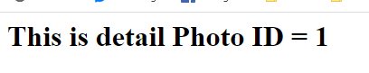
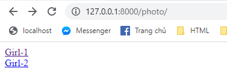
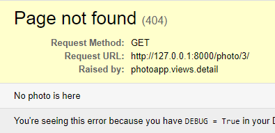
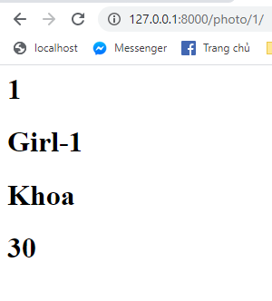

# Section 15: Make Web Applications In Python Using Django 2.0
## Lesson overview
- Install Django==2.0
- Create Project
- Create app
- MVC/MVT model web app
- Database in Django
- Create view list data
- Adding data
- Use admin panel
- Create new urls and view
- Connect database
- Use template
- Design detail view
- Use static file
- Use form in Django
### Using virtual environment
- Sect
- [Tutorial](https://gitlab.com/khoa-genetica/learning-python-masterclass-course/-/tree/develop/section-14-make-web-applications-in-python-using-django#django-tutorial-1-installing-django-on-windows)
### Django 2 Lecture 1 Creating a project
- Install django 2.0
    ```
    pip install django==2.0
    ```
- Create new project, open your folder and run cmd with venv
    ```
    django-admin startproject photo
    ```
- Run server
    ```
    cd photo
    py manage.py runserver
    ```
### Django 2 Lecture 2 Creating An App
- Create app
    ```
    django-admin startapp photoapp
    ```
### Django 2 Lecture 3 Overview of an app
- [Overview app Section 14](https://gitlab.com/khoa-genetica/learning-python-masterclass-course/-/tree/develop/section-14-make-web-applications-in-python-using-django#django-tutorial-4-overview-of-an-app-in-django)
### Django 2 Lecture 4 Creating a View
- Create index in `views.py`
    ```
    def index(request):
        return HttpResponse('<h1>Hello this app Photo</h1>')
    ```
- Create `urls.py` in photoapp
    ```
    from django.conf.urls import url
    from django.urls import path
    from . import views

    urlpatterns = [
        path('', views.index, name='index'),
    ]

    ```
- Connect `photoapp/urls.py` in `photo/urls.py`
    ```
    from django.contrib import admin
    from django.urls import path, include

    urlpatterns = [
        path('admin/', admin.site.urls),
        path('photo/', include('photoapp.urls')),
    ]
    ```
### Django 2 Lecture 5 Applying Migrations
- [Applyling Migrations](https://gitlab.com/khoa-genetica/learning-python-masterclass-course/-/tree/develop/section-14-make-web-applications-in-python-using-django#django-tutorial-6-applying-migrations)
### Django 2 Lecture 6 Creating Models
-  Create models
    ```
    class Photo(models.Model):
        name = models.CharField(max_length=100)
        creator = models.CharField(max_length=100)
        price = models.CharField(max_length=100)
    ```
### Django 2 Lecture 7 Creating Database Tables
- Open `photo/settings.py`
    ```
    INSTALLED_APPS = [
        'django.contrib.admin',
        'django.contrib.auth',
        'django.contrib.contenttypes',
        'django.contrib.sessions',
        'django.contrib.messages',
        'django.contrib.staticfiles',
        'photoapp'
    ]
    ```
    Or
    ```
    INSTALLED_APPS = [
    'photoapp.apps.PhotoappConfig',
    'django.contrib.admin',
    'django.contrib.auth',
    'django.contrib.contenttypes',
    'django.contrib.sessions',
    'django.contrib.messages',
    'django.contrib.staticfiles',
    ]
    ```
- Open cmd run
    ```
    python manage.py makemigrations
    python manage.py migrate
    ```
### Django 2 Lecture 8 Adding Data To Database
- Similar section 14
- [Tutorial](https://gitlab.com/khoa-genetica/learning-python-masterclass-course/-/tree/develop/section-14-make-web-applications-in-python-using-django#django-tutorial-9-adding-data-to-the-database-tables)
    ```
    >>> from photoapp.models import Photo
    >>> Photo.objects.all()
    <QuerySet []>
    >>> a = Photo()
    >>> a.name = 'Girl-1'
    >>> a.creator = 'Khoa'
    >>> a.price = '30'
    >>> a.save()
    >>> b = Photo()
    >>> b.name = 'Girl-2'
    >>> b.creator = 'Quan'
    >>> b.price = '50'
    >>> b.save()
    >>> Photo.objects.all()
    <QuerySet [<Photo: Photo object (1)>, <Photo: Photo object (2)>]>
    >>> a.name
    'Girl-1'
    >>> b.name
    'Girl-2'
    >>>
    ```
### Django 2 Lecture 9 Filtering Results
- Add code in `models.py`
    ```
        def __str__(self):
            return self.name + '-' + self.creator
    ```
- Run shell
    ```
    >>> from photoapp.models import Photo
    >>> Photo.objects.all()
    <QuerySet [<Photo: Girl-1-Khoa>, <Photo: Girl-2-Quan>]>
    >>>
    ```
### Django 2 Lecture 10 Creating A Super User
- [Tutorial](https://gitlab.com/khoa-genetica/learning-python-masterclass-course/-/tree/develop/section-14-make-web-applications-in-python-using-django#django-tutorial-11-admin-pannel-in-django)
### Django 2 Lecture 11 Creating Another View
- Step 1: Create function view in `views.py`
    ```
    def detail(request, photo_id):
        return HttpResponse('<h1>This is detail Photo ID =  ' + str(photo_id) + '</h1>')
    ```
- Step 2: Create url Pattern in `urls.py`
    ```
    urlpatterns = [
        path('', views.index, name='index'),
        path('<int:photo_id>/', views.detail, name='detail'),
    ]
    ```
- Test in localhost


    

### Django 2 Lecture 12 Connecting To The Database
- Create connect database in views.py
    ```
    def index(request):
        all_photo = Photo.objects.all()
        html = ''
        for photo in all_photo:
            url = '/photo/' +str(photo.id)+'/'
            html += '<a href = "'+ url + '">' + str(photo.name) + '</a><br>'
        return HttpResponse(html)
    ```
- Show data in web:


    

### Django 2 Lecture 13 Creating Templates
- In ``views.py`` use template loader in Django:
    ```
    def index(request):
        all_photo = Photo.objects.all()
        template = loader.get_template('photoapp/index.html')
        context = {
            'all_photo': all_photo
        }
        return HttpResponse(template.render(context, request))
    ```
- Create folder ``templates``, create file ``index.html``:
    ```
    <!DOCTYPE html>
    <html lang="en">
    <head>
        <meta charset="UTF-8">
        <title>Title</title>
    </head>
    <body>
        <ul>
            
            <li>
        <a href="/photo/{{photo.id}}">{{photo.name}}</a>
            </li>
            
        </ul>
    </body>
    </html>
    ```
- Result:


    
### Django 2 Lecture 14 Using Render
- Change `views.py`
    ```
    from django.shortcuts import render
    # Create your views here.

    def index(request):
        all_photo = Photo.objects.all()
        context = {
            'all_photo': all_photo
        }
        return render(request, 'photoapp/index.html', context)
    ```
### Django 2 Lecture 15 Raising 404 Error
- Edit `detail()` in `views.py`
    - Add Http404
    - Create detail.html in templates/photoapp
    ```
    from django.http import Http404

    def detail(request,photo_id):
        try:
            photo = Photo.objects.get(id = photo_id)
        except Photo.DoesNotExist:
            raise Http404('No photo is here')
        return render(request,'photo/detail.html',{'photo': photo})
    ```
- Result


    
### Django 2 Lecture 16 Designing The Detail View
- Code HTML in ``detail.html``
    ```
    <h1>{{photo.id}}</h1>
    <h1>{{photo.name}}</h1>
    <h1>{{photo.creator}}</h1>
    <h1>{{photo.price}}</h1>

    ```
- Result


    
### Django 2 Lecture 17 Removing Hard Coded URLs
- In `index.html` change tag `<a>`
```
 <a href ="">{{photo.name}}</a>
```
### Django 2 Lecture 18 Using Namespaces
- Extend project capabilities, if no namespace is set, then for ``, only one url exists.
    - But if you want to expand the product also need detail, you won't create it
    - That's why we need namespaces
- Example:
    In `detail.html`
    ```
    <a href ="">{{photo.name}}</a>
    ```
    In `urls.py`
    ```
    app_name = 'photo'

    urlpatterns = [
        path('', views.index, name='index'),
        path('<int:photo_id>/', views.detail, name='detail'),
    ]
    ```
### Django 2 Lecture 19 Using Static Files
- Create folder `static/photoapp/style.css`
    ```
    .body {
        color: #ff0000;
    }
    .h1 {
        color: yellow;
    }
    
    ```
- Next we need to fix the index.html file
    ```
    
    <link rel="stylesheet" type="text/css" href="" /> 
    ```
### Django 2 Lecture 20 Designing Navbar
-   [Tutorial](https://gitlab.com/khoa-genetica/learning-python-masterclass-course/-/tree/develop/section-14-make-web-applications-in-python-using-django#django-tutorial-21-creating-our-navigation-bar) 
### Django 2 Lecture 21 Navbar Touchup
-   [Tutorial](https://gitlab.com/khoa-genetica/learning-python-masterclass-course/-/tree/develop/section-14-make-web-applications-in-python-using-django#django-tutorial-22-navigation-bar-touchup)
