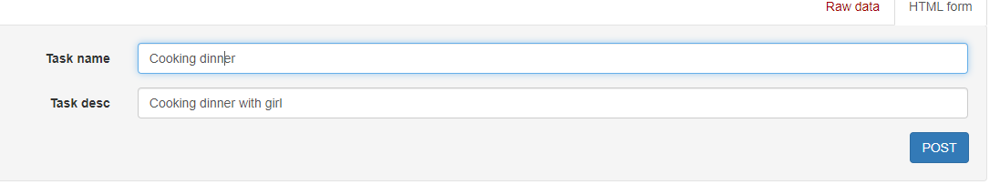
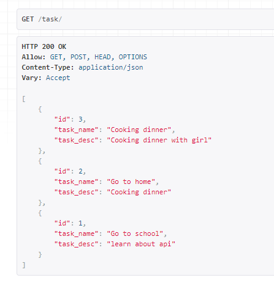
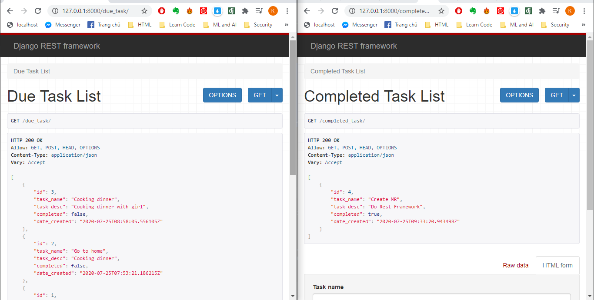
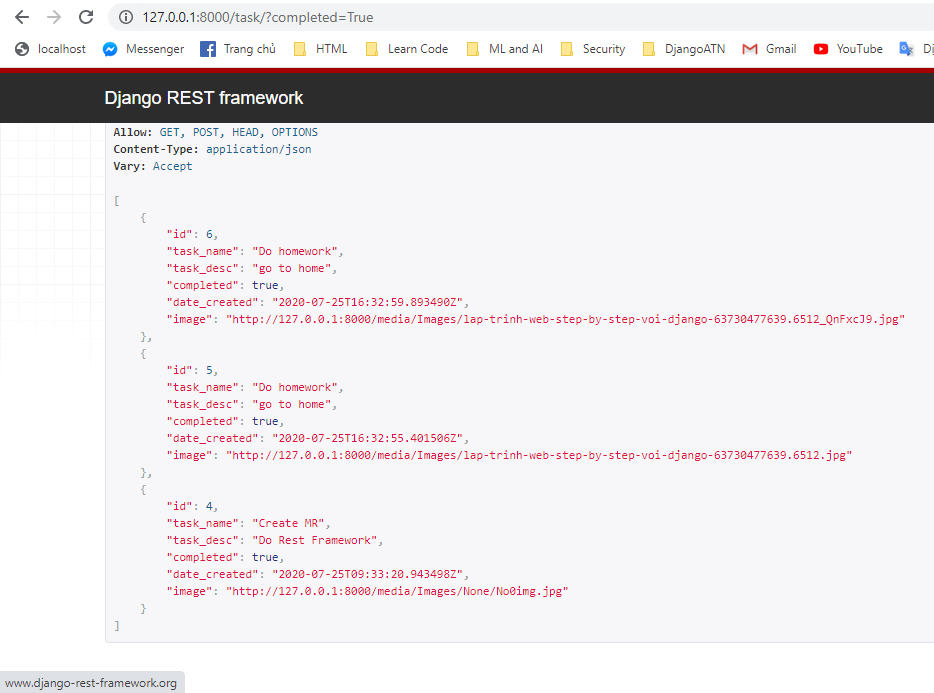
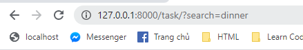
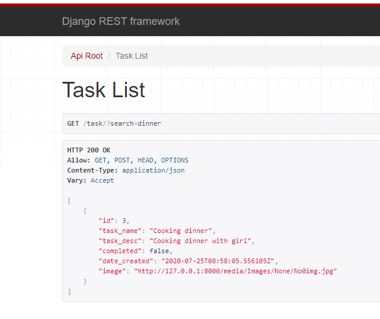

# Section 17: Building REST API's with Python and Django
## Lesson overview
- Learn about API, REST, Django REST framework
- Learn create API data in Django by serializers
- Learn create fields end point by API
- Learn view API data
- Learn create imagefiled in api
- Learn search functional api
- Learn filter api
- Learn api authorization
### Introduction to API
- API is an acronym for Application Programming Interface. Two machines use it to communicate with each other. We will be dealing with Web APIs and then the definition changes to:
    - An API is used by two applications trying to communicate with each other over a network or Internet.
- Django-rest-framework (DRF) is a framework that allows to create Restful webservice quickly, serving for Single Page Application (SPA) applications like Angular / React / Vue.
### Building a basic REST API using Django REST Framework
- Step 1: Open cmd in this folder
    ```
    pip install django
    pip install djangorestframework
    ```
- Step 2: Create project and app
    ```
    django-admin startproject apidemo
    cd apidemo
    django-admin startapp app
    ```
- Step 3: Test runserver
    ```
    python manage.py runserver
    ```
- Step 4: Create model in `models.py`
    ```
    class Task(models.Model):
        task_name = models.CharField(max_length=200)
        task_desc = models.CharField(max_length=200)
        date_created = models.DateTimeField(auto_now=True)
    ```
- Step 5: Serializers, first up we're going to define some serializers. Let's create a new module named `apidemo/app/serializers.py `that we'll use for our data representations.
    ```
    from .models import Task
    from rest_framework import serializers


    class TaskSerializers(serializers.ModelSerializer):
        class Meta:
            model = Task
            fields = ('id', 'task_name', 'task_desc')
    ```
- Step 6: Create view in `views.py`
    ```
    from rest_framework import viewsets
    from .serializers import TaskSerializers
    from .models import Task


    class TaskViewSet(viewsets.ModelViewSet):
        queryset = Task.objects.all().order_by('-date_created')
        serializer_class = TaskSerializers

    ```
- Step 7: Create router in `apidemo/urls.py`
    ```
    from django.conf.urls import include, url
    from django.contrib import admin
    from rest_framework import routers
    from app.views import TaskViewSet

    router = routers.DefaultRouter()
    router.register(r'task', TaskViewSet)

    urlpatterns = [
        url(r'^', include(router.urls)),
        url(r'^admin/', admin.site.urls),
    ]
    ```
- Step 8: Setting app and django rest framework in `settings.py`
    ```
    INSTALLED_APPS = [
        'rest_framework',
        'app',
        'django.contrib.admin',
        'django.contrib.auth',
        'django.contrib.contenttypes',
        'django.contrib.sessions',
        'django.contrib.messages',
        'django.contrib.staticfiles',
    ]
    ```
- Step 9: Open cmd
    ```
    python manage.py makemigrations
    python manage.py migrate
    python manage.py runserver
    ```
- Step 10: Check in local host `http://127.0.0.1:8000/`


    
- Step 11: Click to link for add data api : `http://127.0.0.1:8000/task/` and click button `POST`


    
- Step 12: The add api 


    
### Creating API Endpoints
- Step 1: Create filed boolean in `models.py`
    ```
    class Task(models.Model):
        task_name = models.CharField(max_length=200)
        task_desc = models.CharField(max_length=200)
        date_created = models.DateTimeField(auto_now=True)
        completed = models.BooleanField(default=False)
    ```
- Step 2: Add fields in serializers
    ```
    class TaskSerializers(serializers.ModelSerializer):
        class Meta:
            model = Task
            fields = ('id', 'task_name', 'task_desc', 'completed', 'date_created')
    ```
- Step 3: Create view api in `views.py`
    ```
    class DueTaskViewSet(viewsets.ModelViewSet):
        queryset = Task.objects.all().order_by('-date_created').filter(completed=False)
        serializer_class = TaskSerializers


    class CompletedTaskViewSet(viewsets.ModelViewSet):
        queryset = Task.objects.all().order_by('-date_created').filter(completed=True)
        serializer_class = TaskSerializers
    ```
- Step 4: Add router api
    ```
    from app.views import TaskViewSet
    from app import views

    # router = routers.DefaultRouter()
    router = routers.SimpleRouter()
    router.register(r'task', TaskViewSet)
    router.register(r'completed_task', views.CompletedTaskViewSet)
    router.register(r'due_task', views.DueTaskViewSet)
    ```
- Result:


    
### Adding Image Field
- Step 1: Add Image field for `models.py`
    ```
    image = models.ImageField(upload_to='Images/', default='Images/None/No0img.jpg')
    ```
- Step 2: Add data api for `serializers.py`
    ```
    class TaskSerializers(serializers.ModelSerializer):
        image = serializers.ImageField(max_length=None, use_url=True)
        class Meta:
            model = Task
            fields = ('id', 'task_name', 'task_desc', 'completed', 'date_created', 'image')
    ```
- Step 3: Settings for media_root
    ```
    MEDIA_ROOT = os.path.join(BASE_DIR, 'media')
    MEDIA_URL = '/media/'
    ```
- Step 4:  Add Url in `urls.py`
    ```
    from django.conf.urls.static import static
    from django.conf import settings


    urlpatterns = [
        url(r'^', include(router.urls)),
        url(r'^admin/', admin.site.urls),
    ]+ static(settings.MEDIA_URL, document_root= settings.MEDIA_ROOT)
    ```
- Step 5: Open cmd:
    ```
    python manage.py makemigrations
    python manage.py migrate
    python manage.py runserver
    ```
### Filtering
- Step 1: Add code in `views.py`
    ```
    from django.shortcuts import render
    from rest_framework import viewsets
    from .serializers import TaskSerializers
    from .models import Task
    from rest_framework import filters

    # Create your views here.

    class TaskViewSet(viewsets.ModelViewSet):
        queryset = Task.objects.all().order_by('-date_created')
        serializer_class = TaskSerializers
        filter_backends = (filters.DjangoFilterBackend, filters.OrderingFilter)
        filter_fields = ('completed',)
        ordering = ('-date_created',)
    ```
- Step 2: Use default router for API'
    ```
    router = routers.DefaultRouter()
    router.register(r'task', views.TaskViewSet)

    urlpatterns = [
        url(r'^', include(router.urls)),
        url(r'^admin/', admin.site.urls),
    ]+ static(settings.MEDIA_URL, document_root= settings.MEDIA_ROOT)

    ```
- Step 3: Settings app
    ```
    INSTALLED_APPS = [
        'rest_framework',
        'app',
        ...
        'django.contrib.staticfiles',
        'django_filters'
    ]
    ```
- Step 4: Test link API


    
### Search functionality
- Create search function
    ```
    class TaskViewSet(viewsets.ModelViewSet):
        queryset = Task.objects.all().order_by('-date_created')
        serializer_class = TaskSerializers
        filter_backends = (filters.DjangoFilterBackend, filters.OrderingFilter, filters.SearchFilter)
        filter_fields = ('completed',)
        ordering = ('-date_created',)
        search_fields = ('task_name', )
    ```
- Result:


    


    
### API Authentication
- Modify `views.py`
    ```
    from django.shortcuts import render
    from rest_framework import viewsets
    from .serializers import TaskSerializers, UserSerializer
    from .models import Task
    from rest_framework import filters
    from rest_framework.permissions import IsAuthenticated, AllowAny
    from django.contrib.auth import get_user_model
    from rest_framework.generics import CreateAPIView

    # Create your views here.

    class TaskViewSet(viewsets.ModelViewSet):
        permission_classes = (IsAuthenticated,)
        queryset = Task.objects.all().order_by('-date_created')
        serializer_class = TaskSerializers
        filter_backends = (filters.DjangoFilterBackend, filters.OrderingFilter, filters.SearchFilter)
        filter_fields = ('completed',)
        ordering = ('-date_created',)
        search_fields = ('task_name', )

    class CreateUserView(CreateAPIView):
        model = get_user_model()
        permission_classes = (AllowAny,)
        serializer_class = UserSerializer
    ```
- Add UserSerializers
    ```
    from django.contrib.auth import get_user_model


    class UserSerializer(serializers.ModelSerializer):
        password = serializers.CharField(write_only=True)

        def create(self, validated_data):
            user = get_user_model().objects.create(
                username=validated_data['username']
            )
            user.set_password(validated_data['password'])
            user.save()
            return user

        class Meta:
            model = get_user_model()
            fields = ('username', 'password')
    ```
- Add url
    ```
    from app.views import TaskViewSet, CreateUserView
    from app import views
    from django.conf.urls.static import static
    from django.conf import settings

    router = routers.DefaultRouter()
    router.register(r'task', views.TaskViewSet)

    urlpatterns = [
        url(r'^register/$', views.CreateUserView.as_view(),name='user'),
        url(r'^api-auth/', include('rest_framework.urls', namespace='rest_framework')),
        url(r'^', include(router.urls)),
        url(r'^admin/', admin.site.urls),
    ]+ static(settings.MEDIA_URL, document_root= settings.MEDIA_ROOT)
    ```

