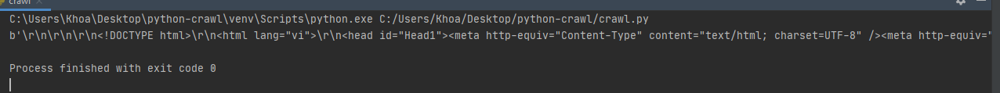
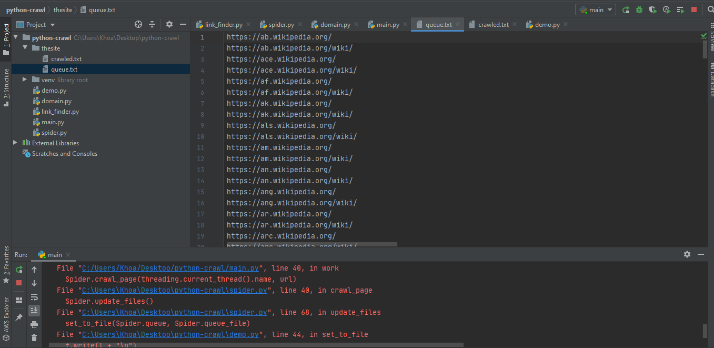

# Section 18: Learn How To Crawl Websites Using Python : Web Crawling
## Lesson overview
- Learn about urlib, scrapy
- Learn define folder and file for save data 
- Learn code multi threads and process
- Learn about get link in the one url
### Python Web Crawler Part -1
- Scraping the site's data, simply need to use an existing library to send a request to the server that returns the .html file of that website
    ```
    from urllib.request import urlopen

    html = urlopen("https://kenh14.vn")
    print(html.read())
    ```
- Result:


    
### Python Web Crawler Part -2
- Beautiful Soup is a Python library for taking data out of HTML and XML. It parses structures into data, which are often used for navigation, searching, etc.The current version is BeautifulSoup 4, and BeautifulSoup3 has stopped growing and is almost no longer used.
    ```
    pip install BeautifulSoup4==4.5.0 
    pip install beautifulscraper==1.0.3
    ```
- With the support library, you can customize your web data with card or data options.
    ```
    from urllib.request import urlopen
    from bs4 import BeautifulSoup

    html = urlopen("https://kenh14.vn")
    bobject = BeautifulSoup(html.read(), "html.parser")
    print(bobject.title)
    ```
- Result:
    ```
    <title>Kênh tin tức giải trí - Xã hội - Kenh14.vn</title>
    ```
- 
### Python Web Crawler Part -3
- In this section, we will create a website to scratch the data, the scanned links will be saved in two types of files
    - `crawled.txt` contains read links.
    - `queue.txt` contains scraped links that are pending comparison
### Python Web Crawler Part -4
- Create function make directory in folder project
    ```
    import os

    def create_dir(directory):
        if not os.path.exists(directory):
            print("Creating the directory" + directory)
            os.makedirs(directory)

    create_dir('thesite')
    ```
### Python Web Crawler Part -5
- Create function make data in directiory
    ```
    def create_data(project_name, base_url):
        queue = os.path.join(project_name, 'queue.txt')
        crawled = os.path.join(project_name, 'crawled.txt')
        if not os.path.isfile(queue):
            write_file(queue, base_url)
        if not os.path.isfile(crawled):
            write_file(crawled)


    def write_file(path, data):
        with open(path, 'w') as f:
            f.write(data)
    ```
### Python Web Crawler Part -6
- Add data, delete data
    ```
    def write_file(path, data):
        with open(path, 'w') as f:
            f.write(data)


    def append_to_file(path, data):
        with open(path, 'a') as f:
            f.write(data, '\n')


    def detele_file(path):
        open(path,'w').close()
    ```

### Python Web Crawler Part -7
- Create a function to classify duplicate links
```
def file_to_set(file_name):
    results = set()
    with open(file_name, 'rt') as f:
        for line in f:
            results.add(line.replace('\n', ''))
    return results


def set_to_file(links, file_name):
    with open(file_name, 'w') as f:
        for l in sorted(links):
            f.write(l + '\n')
```
### Python Web Crawler Part -8
- Create a file named link_finder.py that analyzes the html files.
    ```
    from html.parser import HTMLParser
    from urllib import parse


    class LinkFinder(HTMLParser):


        def __init__(self,base_url,page_url):
            super().__init__()
            self.base_url = base_url
            self.page_url = page_url
            self.links = set()

        def error(self,message):
            pass

        def handle_starttag(self, tag, attrs):
            print(tag)
    ```
### Python Web Crawler Part -9
- Create a function that takes a tag, then parses each tag attribute a, and takes the link value in the "href" character.
    ```
    from html.parser import HTMLParser
    from urllib import parse


    class LinkFinder(HTMLParser):


        def __init__(self,base_url,page_url):
            super().__init__()
            self.base_url = base_url
            self.page_url = page_url
            self.links = set()

        def error(self,message):
            pass

        def handle_starttag(self, tag, attrs):
            if tag == 'a':
                for (attrinute,value) in attrs:
                    if attrinute == 'href':
                        url = parse.urljoin(self.base_url,value)
                        self.links.add(url)

        def page_links(self):
            return self.links

    ```
### Python Web Crawler Part -10
- Create a Spider class, to pass information to the defined functions.
```
class Spider:
    project_name = ''
    base_url = ''
    domain_name = ''
    queue_file = ''
    crawled_files = ''
    queue = set()
    crawled = set()

    def __init__(self):
```
### Python Web Crawler Part -11
- Define objects
```
    def __init__(self,project_name, base_url, domain_name):

        Spider.project_name = project_name
        Spider.base_url = base_url
        Spider.domain_name = domain_name
        Spider.queue_file = Spider.project_name + '/queue.txt'
        Spider.crawled_file = Spider.project_name + '/crawled.txt'
        self.boot()
        self.crawl_page('First spider', Spider.base_url)
```
### Python Web Crawler Part -12
- Create function boot 
    ```
        def boot(self):
            create_dir(Spider.project_name)
            create_data(Spider.project_name, Spider.base_url)
            Spider.queue = file_to_set(Spider.queue_file)
            Spider.crawled = file_to_set(Spider.crawled_file)
    ```
### Python Web Crawler Part -13
- Create `crawl_page()`
```
    @staticmethod
    def boot(self):
        create_dir(Spider.project_name)
        create_data(Spider.project_name, Spider.base_url)
        Spider.queue = file_to_set(Spider.queue_file)
        Spider.crawled = file_to_set(Spider.crawled_file)

    @staticmethod
    def crawl_page(thread_name, page_url):
        if page_url not in Spider.crawled:
            print(thread_name + 'Now crawling' + page_url)
            print('Queue' + str(len(Spider.queue)) + '|Crawled ' + str(len(Spider.crawled)))
            Spider.add_links_to_queue(Spider.gather_links(page_url))
            Spider.queue.remove(page_url)
            Spider.crawled.add(page_url)
            Spider.update_files(page_url)
```
### Python Web Crawler Part -14
- Create `gather_links()`
```
    @staticmethod
    def gather_links(page_url):
        html_string = ''
        try:
            response = urlopen(page_url)
            if 'text.htm' in response.getheader('Content-type'):
                html_bytes = response.read()
                html_string = html_bytes.decode("utf-8")
            finder = LinkFinder(Spider.base_url, page_url)
            finder.feed(html_string)
        except Exception as e:
            print(str(e))
            return set()
        return LinkFinder.page_links
```
### Python Web Crawler Part -15
- Create `add_links_queue()`
    ```
        @staticmethod
        def add_links_to_queue(links):
            for url in links:
                if (url in Spider.queue) or (url in Spider.crawled)
                    continue
                if Spider.domain_name != get_domain_name(url):
                    continue
                Spider.queue.add(url)

        @staticmethod

        def update_files():
            set_to_file(Spider.queue, Spider.queue_file)
            set_to_file(Spider.crawled, Spider.crawled_file)
    ```
### Python Web Crawler Part -16
- Create get,sub domain for crawl
    ```
    from urllib.parse import urlparse


    def get_domain_name(url):
        try:
            results = get_sub_domain_name(url).split('.')
            return results[-2] + '.' + results[-1]
        except:
            return ''


    def get_sub_domain_name(url):
        try:
            return urlparse(url).netloc
        except:
            return ''
    ```
### Python Web Crawler Part -17
- Create properties for crawl
    ```
    import threading
    from queue import Queue
    from spider import Spider
    from domain import *
    from demo import *
    PROJECT_NAME ='thesite'
    HOMEPAGE = 'https://www.djangoadmintutorials.com/'
    DOMAIN_NAME = get_domain_name(HOMEPAGE)
    QUEUE_FILE = PROJECT_NAME + '/queue.txt'
    CRAWLED_FILE = PROJECT_NAME + '/crawled.txt'
    NUMBER_OF_THREADS = 8
    queue= Queue()
    Spider(PROJECT_NAME,HOMEPAGE,DOMAIN_NAME)
    ```
### Python Web Crawler Part -18
- Create function crawl
    ```
    def crawl():
        queued_links = file_to_set(QUEUE_FILE)
        if len(queued_links) > 0:
            print(str(len(queued_links)) + ' Links in the queue ')
            create_jobs()


    def create_jobs():
        for link in file_to_set(QUEUE_FILE):
            queue.put(link)
            queue.join(
    ```
### Python Web Crawler Part -19
- Create work with thread
    ```
    def create_workers():
        for _ in range(NUMBER_OF_THREADS):
            t = threading.Thread(target=work)
            t.daemon = True
            t.start()


    def work():
        while True:
            url = queue.get()
            Spider.crawl_page(threading.current_thread().name, url)
            queue.task_done()


    create_workers()
    crawl()
    ```
- Result :


    
### Web Crawler Source Code
