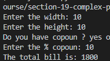
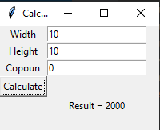
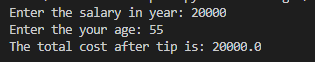
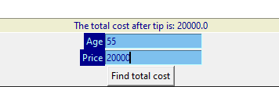
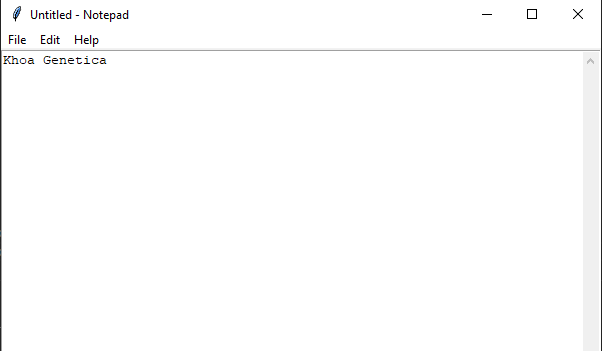
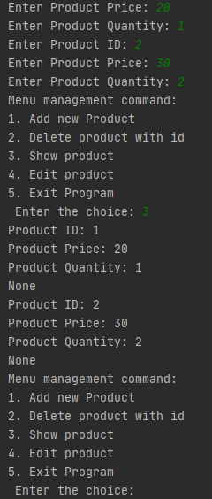
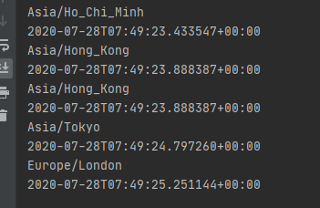
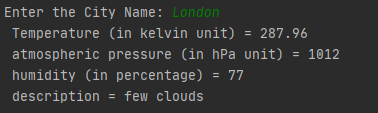

# Section 19: Complex Python Challenges
## Lesson overview
### Challenge 1: Tile contractor app.
- A tile contractor charges for his work in terms of tiles fitted per square feet, example if he charges `20$/square` feet means for `100sqft` the charges would be `$2000` You want to build a simple calculator for him so that he can quote a final amount to his customer.
- Level 1:
    The calculator should have the following features:
    1. Should accept inputs as the length and breadth of the room to be tiled.
    2. Should give an option to offer discount in terms of percentage.
    3. Should give output as total area covered, total discount in terms of $, the total amount customer has to pay.
    - [Code](code/chanllenge-1-1.py)

    
- Level 2:
    1. Try accepting length values in different units, build a separate function to convert unit from meter to feet.
    2. Try to make the above calculator in the form of a GUI using Tkinter.
    3. Try to optimize the code. i.e. Try to use less variables and less redundancies.
    - [Code](code/chanllenge-1-2.py)

    

### Challenge 2: Tax calculator.
- A particular state in XYZ country charges taxes on its citizen's income. These tax rates varies from person to person depending on income and age and hence they have to pay different taxes.Here are the tax rules laid by the government which states the percent tax for category of individual.
    - For taxpayers under 60 years of age:
        - annual income up to: $20,000 -> No tax
        - annual income from $20,001 to $50,000 -> 20% tax
        - annual income from $50,001 to $100,000 -> 30% tax
        - annual income above $100,001 -> 40% tax

    - For taxpayers above 60 years of age:
        - annual income up to: $20,000 -> No tax
        - annual income from $20,001 to $50,000 -> 10% tax
        - annual income from $50,001 to $100,000 -> 20% tax
        - annual income above $100,001 -> 30% tax

- Level 1: Build a tax calculator which accepts the age and total income of an individual and calculates the total tax to be paid.
    - [Code](code/chanllenge-2-1.py)

    

- Level 2:
    1. Design a GUI for the above code.
    2. Try to add additional category of taxpayers such as businesses and charge them 7.5% additional taxes (considering taxes for age group below 60).
    - [Code](code/chanllenge-2-2.py)

    

### Challenge 3: Text Editor
- Write a Python script to make a notepad like text editor using Tkinter which has the following features.

- Level 1:
    1. Should be able to save text files.
    2. Should be able to write normal text.

- Level 2:
    1. Should be able to delete files.
    2. Should be able to edit existing files.

- Hint: This challenge needs some research on how to implement complex features, feel free to do a google search to figure out how a particular feature can be implemented.

- [Code](code/chanllenge-3.py)

    

### Challenge 4: Product Inventory Project
- Create an application which manages an inventory of products. Create a product class which has a price, id, and quantity on hand. Then create an inventory class which keeps track of various products and can sum up the inventory value. Should have the following features.
    1. Ability to add new products.

    2. Ability to delete existing products.

    3. Ability to view product information.

    4. Ability to edit existing products.

- [Code](code/chanllenge-4.py)

    

### Challenge 5: Airline / Hotel Reservation System
- Create a reservation system which books airline seats or hotel rooms. It charges various rates for particular sections of the plane or hotel. Example, first class is going to cost more than coach. Hotel rooms have penthouse suites which cost more. Keep track of when rooms will be available and can be scheduled.

- Level 1: Design a simple console based app for the above problem statement.
- Level 2: Design a GUI based application.

### Challenge 6: Build a scientific calculator using Tkinter.
- In one of the sections in the course we already learned about building a simple calculator. For this challenge your job is to build a scientific calculator.

### Challenge 7: Build a global clock which shows current local timings across the globe.
- Time zones across the world vary differently. Build a watch which shows timings of at least 5 different global locations all at the same time.
- [Code](code/chanllenge-7.py)

    

### Challenge 8: Real time weather app.

- Build an app which displays weather data as per your location using an API.
- Description:
    1. The app should display current weather conditions like temperature, pressure and humidity. 
    2. User should be able to choose from different locations.

- Hint: This challenge needs some research as well. Search for some weather data providers which provide an API, read their documentation to know how to use their API to get real time weather data.
- [Code](code/chanllenge-8.py)

    

### Challenge 9: Web Crawler

- Build a web crawler which crawls any real estate listing site of your own choice, collect the property data and save it into a text file.

