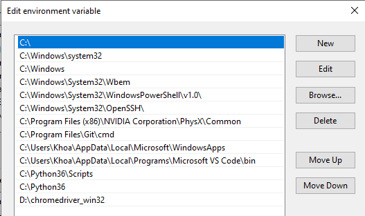

# Section 20: Automation With Selenium Web Driver and Python
## Lesson overview
- Installing Selenium
- Opening a URL
- Automating Google Search
- Find Elements By XPATH
- Clicking Links
- Refreshing a Webpage
- Using Forward and Backward Navigation Buttons
- Scrolling and Getting the Current URL
### Introduction to Selenium
- Selenium Python bindings provides a simple API to write functional/acceptance tests using Selenium WebDriver. Through Selenium Python API you can access all functionalities of Selenium WebDriver in an intuitive way.
- Selenium Python bindings provide a convenient API to access Selenium WebDrivers like Firefox, Ie, Chrome, Remote etc. The current supported Python versions are 2.7, 3.5 and above.
- This documentation explains Selenium 2 WebDriver API. Selenium 1 / Selenium RC API is not covered here.
### Installing Selenium
- Install selenium with python
    ```
    pip install selenium
    ```
- Install chormedriverm, choose  the OS and download
    ```
    https://chromedriver.storage.googleapis.com/index.html?path=85.0.4183.38/
    ```
- Add to path `chormedriver.exe`in Edit the system environment variables
- Choose PATH and click new then paste address foler


    
### Opening a URL
- Example code:
```
from selenium import webdriver

driver = webdriver.Chrome()
driver.get("https://www.google.com")
```
### Automating Google Search
- Finf id, class, name of attribute html for your test
- Run scripts
    ```
    from selenium import webdriver
    from selenium.webdriver.common.keys import Keys
    import time
    from time import sleep


    driver = webdriver.Chrome()
    driver.get("http://www.google.com")
    elem = driver.find_element_by_name('q')
    elem.send_keys("Python")
    elem.send_keys(Keys.RETURN)
    time.sleep(5)
    driver.quit()
    ```
### Find Elements By XPATH
- Types of XPATH
    - Absolute XPath: The absolute XPath begins with a single slash "/", which allows you to specify an absolute path to the UI object
        - For example, html / body / div [1] / div [2] / form / div / div [3] / div [1] / div / div [2] / div [1] / div [1] / div / div / input
    - The similar XPath: Begins with two slashes "//", which allows you to specify a UI object anywhere on the web page, without having to start with the html tag in the path.
        - For example: // div // input: allows to retrieve all the input tags that were previously a div tag.
- Several ways to identify elements with XPath
    - Identify by the `"@"` attribute
    - Identify by the `text ()` attribute
    - Identify by using the `OR` and `AND` operators
    - Identify by `preceding` and `following`
### Clicking Links
- Command:
    ```
    driver = webdriver.Chrome()
    driver.get("http://www.google.com")
    elem = driver.find_element_by_link_text("Gmail")
    time.sleep(5) # sleep for 5 seconds so you can see the results
    elem.click()
    ```
### Refreshing a Webpage
- Command:
    ```
    driver = webdriver.Chrome()
    driver.get("http://www.google.com")
    elem = driver.find_element_by_link_text("Gmail")
    time.sleep(5) # sleep for 5 seconds so you can see the results
    elem.click()
    time.sleep(5)
    driver.refresh()
    ```
### Using Forward and Backward Navigation Buttons
- Command:
    ``` 
    driver = webdriver.Chrome()
    driver.get("http://www.google.com")
    elem = driver.find_element_by_link_text("Gmail")
    time.sleep(5) # sleep for 5 seconds so you can see the results
    elem.click()
    time.sleep(5)
    driver.back()
    time.sleep(5)
    driver.forward()
    ```
### Scrolling and Getting the Current URL
- Access by element, tag, ... at HOME and END in browser
    ```
    driver = webdriver.Chrome()
    driver.get("http://www.wikipedia.org")
    elem = driver.find_element_by_tag_name('html')
    time.sleep(5) # sleep for 5 seconds so you can see the results
    elem.send_keys(Keys.END)
    time.sleep(5)
    elem.send_keys(Keys.HOME)
    ```
